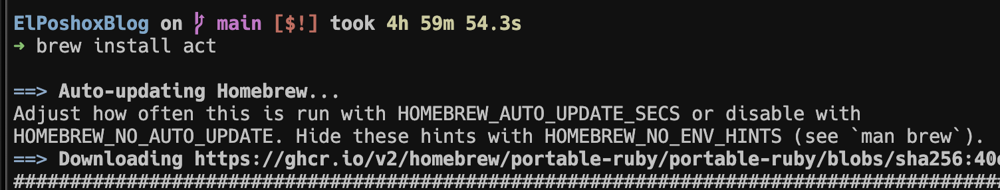
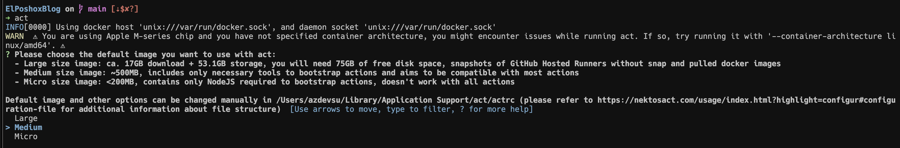


¡Adiós, Commit-Push! Ejecuta tus GitHub Actions Localmente con `act`


Si trabajas con GitHub Actions, probablemente conozcas el tedioso ciclo de modificar un archivo `.github/workflows`, hacer commit, push y esperar a que GitHub ejecute el workflow para ver si nuestros cambios funcionan. Este proceso puede ser lento y frustrante, especialmente cuando estás depurando o haciendo ajustes pequeños.

Pero, ¿qué pasaría si pudieramos probar nuestros workflows directamente en nuestra máquina, sin necesidad de subir nada a GitHub?. Aquí es donde entra `act`, una herramienta de línea de comandos que nos **permite ejecutar nuestros GitHub Actions localmente**. Es una solución muy buena para obtener feedback rápido y usar nuestros workflows como un task runner local.

**act** se basa en la herramienta CLI `nektos/act`. Incluso hay una extensión de Visual Studio Code llamada "**GitHub Local Actions**" que nos permite usar act directamente desde nuestro editor, haciendo la experiencia aún más fluida. Esta extensión nos permite ejecutar flujos de trabajo/jobs completos o específicos localmente, activar eventos estándar de GitHub, ver el historial de ejecución de flujos de trabajo y gestionar la configuración de los mismos, como secrets, variables, inputs, runners, payloads y opciones de ejecución.

## Prerrequisitos
- Docker (**act** utiliza Docker para ejecutar las acciones, creando contenedores basados en las imágenes definidas en tus workflows).

## Instalando act
La instalación es sencilla y varía según tu sistema operativo:
- **MacOS**: `brew install act`
- **Linux**: `curl https://raw.githubusercontent.com/nektos/act/master/install.sh | sudo bash`

Ejecutamos el comando correspondiente en la terminal y seguimos las instrucciones. 

## Configuración e Inicialización de act

**Nota!** El Docker Daemon debe de estar corriendo en tu máquina.


Una vez instalado, el siguiente paso es inicializarlo en el directorio de tu proyecto. Cuando ejecutamos **act** por primera vez, nos preguntará qué tamaño de imagen Docker deseamos usar por defecto, es muy importante que definamos la que más se ajuste a nuestras necesidades.

Podemos elegir entre diferentes tamaños de imagen Docker:
1. **Micro**: Aproximadamente **200 MB**, usado por proyectos pequeños. Contiene solo NodeJS, que es requerido para arrancar acciones y no funciona con todas las acciones.
2. **Medium**: Aproximadamente **500 MB**, incluye solo las herramientas necesarias para arrancar acciones y tiene como objetivo ser compatible con la mayoría de las acciones. Usado por proyectos grandes.
3. **Large**: Aproximadamente **17 GB** de descarga (+ **53.1 GB** de almacenamiento), necesitas **75 GB** de espacio libre en disco. Son snapshots de los GitHub Hosted Runners sin snap e imágenes docker pulled. Usado mayormente por empresas (Enterprise).

**act** descargara la imagen que elijas y la utilizara para ejecutar tu GitHub Action localmente. Después de descargar la imagen del repositorio de Docker, el CLI ejecuta la acción de GitHub.

La primera vez que ejecutemos act en un proyecto, la salida en la terminal se verá similar a esto, preguntándote sobre la imagen:

Después de seleccionar una opción (por ejemplo, **Micro**) y descargar la imagen, **act** generará un archivo de configuración llamado ~/.actrc en tu laptop para la configuración. El archivo ~/.actrc contiene el nombre de la imagen Docker. Si deseas cambiar la imagen por defecto en el futuro o instalar otras imágenes Docker, simplemente puedes eliminar el archivo ~/.actrc y volver a ejecutar act para seleccionarla de nuevo.