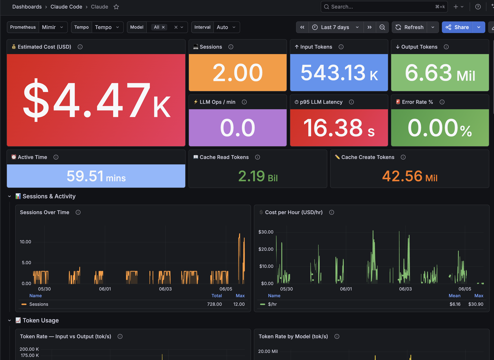
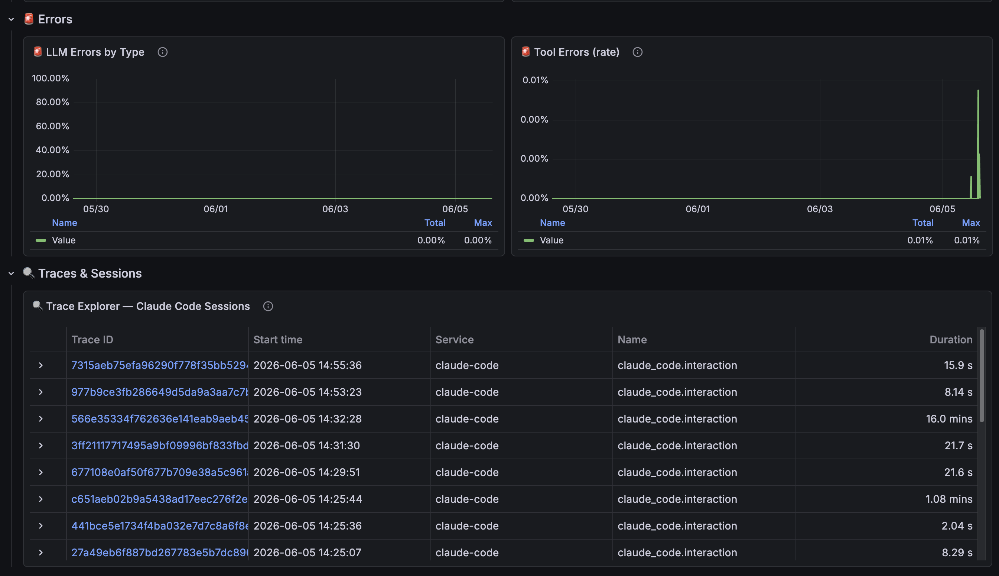
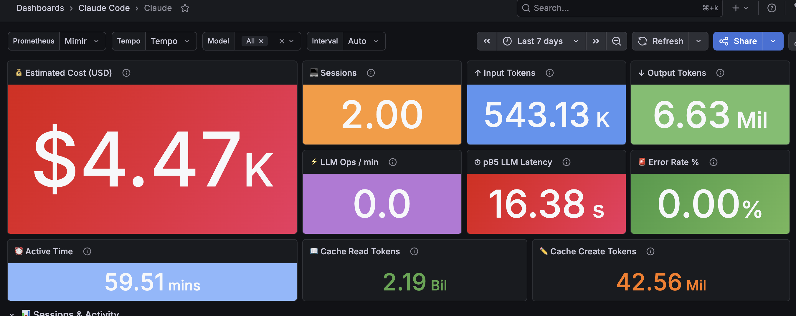


From Claude Code's env vars to a 34-panel Grafana dashboard. All running on a homelab with Talos Linux, ArgoCD, Mimir and Tempo.


I wanted to know how much each Claude Code session cost me, which models burned the most tokens, and how long I spent blocked waiting for tool call approvals. The answer was in the `OTEL_EXPORTER_*` env vars that Claude Code recently started supporting. What wasn't documented anywhere were the 5 problems I had to solve before any data actually showed up in my observability stack.

This article covers the full pipeline, from Claude Code's env vars to a 34-panel Grafana dashboard. Everything running on a homelab with Kubernetes (Talos Linux), ArgoCD, Mimir, Tempo, and an OTel Collector.

## What Claude Code Emits

First things first: what data comes out.

### Metrics (3)

| Metric | Labels | What it measures |
| --- | --- | --- |
| `claude_code.cost.usage` | `model` | Estimated cost in USD per operation |
| `claude_code.token.usage` | `model`, `type` | Tokens consumed (input, output, cacheRead, cacheCreation) |
| `claude_code.active_time.total` | *(no model label)* | Cumulative active time in seconds |

### Traces (5 span types)

| Span | Key attributes |
| --- | --- |
| `claude_code.interaction` | Root span per interaction |
| `claude_code.llm_request` | `model`, `input_tokens`, `output_tokens`, `cache_read_tokens`, `duration_ms`, `ttft_ms`, `stop_reason` |
| `claude_code.tool` | `tool_name` |
| `claude_code.tool.execution` | `success`, `duration_ms` |
| `claude_code.tool.blocked_on_user` | Time waiting for human approval |

That's enough for a full dashboard: cost, tokens, latency by model, most-used tools, error rate, and a trace explorer.

## Architecture


graph LR
    CC[Claude Code] -->|OTLP gRPC :4317| OC[OTel Collector]
    OC -->|OTLP HTTP| Mimir[Mimir]
    OC -->|OTLP gRPC| Tempo[Tempo]
    Tempo -->|remote_write| Mimir
    Mimir --> Grafana
    Tempo --> Grafana


The OTel Collector runs as a DaemonSet on the cluster. It receives OTLP over gRPC, processes metrics through two custom processors (explained below), and forwards them to Mimir. Traces go to Tempo, which also generates span-metrics and writes them to Mimir via remote_write.

## Claude Code Env Vars

Minimal config to get Claude Code sending telemetry:

```bash
export OTEL_EXPORTER_OTLP_ENDPOINT="https://otel-collector.elposhox.dev:4317"
export OTEL_EXPORTER_OTLP_PROTOCOL="grpc"
export OTEL_TRACES_EXPORTER="otlp"
export OTEL_METRICS_EXPORTER="otlp"
```

I put these in `~/.zshrc` so they're always active. Simple enough, but the first gotcha is right around the corner.

## Problem 1: Claude Code Strips OTEL_* from Child Processes

If you run `env | grep OTEL` inside Claude Code's Bash tool, you get nothing back. Claude Code removes all `OTEL_*` variables from child processes by design, to prevent internal tools from contaminating telemetry.

In practice, **you can't verify OTEL config from inside Claude Code**. You have to trust the vars exist in the parent shell and verify from the collector side (OTel Collector logs or metrics showing up in Mimir).

No fix for this. It's intentional. Just know about it so you don't burn time debugging ghosts.

## Problem 2: Delta vs Cumulative, Mimir Rejects with HTTP 400

Claude Code sends metrics with **delta temporality** (each data point is the increment since the last send). Mimir requires **cumulative temporality** (each data point is the running total).

The symptom: OTel Collector logged successful exports, but Mimir responded HTTP 400 with `invalid temporality and type combination`. Nothing showed up in Grafana.

The fix is the `deltatocumulative` processor in the OTel Collector:

```yaml
processors:
  deltatocumulative:

service:
  pipelines:
    metrics:
      processors:
        - memory_limiter
        - resourcedetection
        - attributes
        - transform/claude
        - deltatocumulative  # before batch
        - batch
```

Order matters: `deltatocumulative` goes **before** `batch` and **after** any label transformations.

## Problem 3: OTEL Labels vs Your Own Schema

I had historical Claude Code data from a backfill script with normalized labels: `token_type=cache_read`, `token_type=cache_create`. But Claude Code sends over OTEL: `type=cacheRead`, `type=cacheCreation`.

Two different schemas for the same data. Grafana queries couldn't cover both without an ugly `{token_type=~"cache_read|cacheRead"}`.

Fix: normalize at ingestion time with a `transform/claude` processor:

```yaml
processors:
  transform/claude:
    metric_statements:
      - context: datapoint
        statements:
          - set(attributes["token_type"], attributes["type"]) where attributes["type"] != nil
          - replace_pattern(attributes["token_type"], "^cacheRead$", "cache_read")
          - replace_pattern(attributes["token_type"], "^cacheCreation$", "cache_create")
          - delete_key(attributes, "type") where attributes["token_type"] != nil
```

Copies `type` to `token_type`, normalizes camelCase to snake_case, and drops the original label. After this, historical and real-time data share the same schema.

## Problem 4: Tempo Span-Metrics Not Generating

I wanted latency-by-model panels, most-used tools, and error rate, all derived from traces. Tempo can generate these metrics automatically with its **span-metrics processor** and write them to Mimir.

I configured the processor in Tempo's `values.yaml`:

```yaml
metricsGenerator:
  enabled: true
  remoteWriteUrl: "http://mimir-gateway.mimir.svc.cluster.local/api/v1/push"
  processor:
    span_metrics:
      dimensions:
        - model
        - tool_name
        - success
```

Synced with ArgoCD. Nothing happened. The `traces_spanmetrics_latency_bucket` and `traces_spanmetrics_calls_total` metrics never appeared in Mimir.

What was missing: the processors need to be activated in the `overrides` section. Without this, Tempo's distributor receives traces but **doesn't route them to the metrics-generator**:

```yaml
overrides:
  defaults:
    metrics_generator:
      processors:
        - span-metrics
        - local-blocks
```

Tempo docs mention `metricsGenerator.enabled: true` but don't make it clear that `overrides.defaults.metrics_generator.processors` is mandatory. Without both, nothing happens. No error, no warning. Complete silence.

## Problem 5: Dashboard Dies with the Pod

The Grafana dashboard lived only in Grafana's internal database. If the pod died, it took the dashboard with it.

Fix: export the JSON and wrap it in a ConfigMap with the label Grafana's sidecar watches for:

```yaml
apiVersion: v1
kind: ConfigMap
metadata:
  name: grafana-dashboard-claude-code
  labels:
    grafana_dashboard: "1"
  annotations:
    grafana_folder: "Claude Code"
data:
  claude-code.json: |
    { ... dashboard JSON ... }
```

The sidecar picks up any ConfigMap with `grafana_dashboard: "1"` across all namespaces and loads it on its own. If Grafana restarts, it reloads everything from the ConfigMaps.

To keep it in sync, a 30-line script (`sync-dashboard.sh`) exports the JSON from Grafana's API and regenerates the ConfigMap:

```bash
GRAFANA_USER=admin GRAFANA_PASS='...' ./sync-dashboard.sh
git add . && git commit -m "update dashboard" && git push
# ArgoCD sync > ConfigMap updated > sidecar reloads
```





## The Dashboard: 34 Panels

The final result has 34 panels organized in sections:

**Overview**: Total cost, total tokens, sessions, LLM ops/min, error rate, p95 latency

**Tokens**: Input vs Output over time, Token Rate by Model

**LLM Performance**: Latency p50/p95/p99, latency by model, latency heatmap

**Tools**: Calls by type, average duration per tool, tool errors

**Operations**: Operations by model, model distribution, sessions over time

**Trace Explorer**: Table with Tempo traces, click to see full spans



Queries combine data from two sources:
- **Direct metrics** (OTel Collector to Mimir): `claude_code_cost_usage`, `claude_code_token_usage`, `claude_code_active_time_total`
- **Span-metrics** (Tempo to Mimir): `traces_spanmetrics_latency_bucket`, `traces_spanmetrics_calls_total`

## What I Learned

### What works
- The pipeline is stable. You solve the 5 problems once and data flows without touching anything again.
- Tempo span-metrics save you a ton of work. Latency by model, error rate, tool calls, all derived from traces with no extra instrumentation.
- Dashboard-as-code with sidecar is the way to go. No manual intervention after deploy.

### What's missing
- Claude Code doesn't emit logs over OTEL. Only metrics and traces. If you want conversation logs, you need a different approach.
- `active_time.total` has no `model` label, so you can't filter active time by model.
- No way to correlate a Claude Code session with a specific commit or PR from the telemetry alone.

### Worth it?
If you use Claude Code daily and care about how much you spend, which model performs best, or where time goes, yes. Setup takes about 2 hours counting the gotchas I documented here. After that you don't touch it again.
