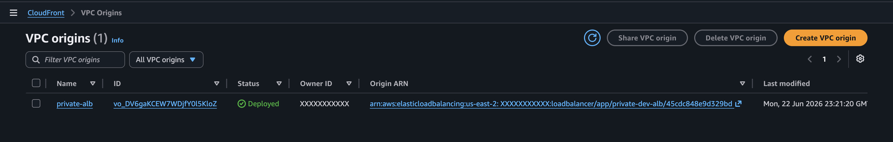
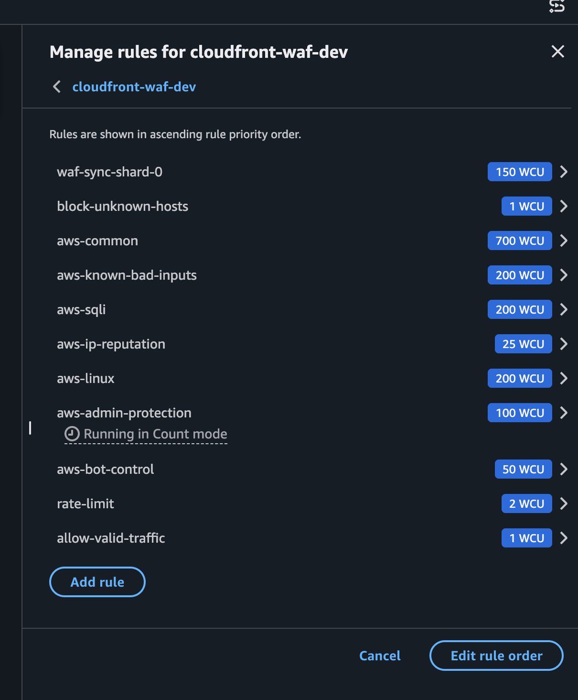
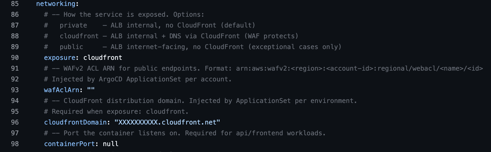


Two patterns for exposing EKS services. When to use each one, how the WAF evaluation chain works with COUNT + labels, and why your ALB probably shouldn't have a public IP.


## Two patterns, each with its place

If you run EKS services that need public traffic, you have two architecture options:

**Pattern A: Public ALB + Regional WAF.**
The ALB has a public IP, WAF attaches directly to the ALB, traffic arrives with no intermediaries. This works and is necessary for gRPC (WAF skips body inspection for gRPC over CloudFront), WebSockets with idle times over 10 minutes (**hard limit on CloudFront, not configurable**), and APIs with response times over 180 seconds.

**Pattern B: CloudFront + VPC Origin + WAF.** The ALB is private, CloudFront is the only entry point, WAF attaches to CloudFront (global scope, always us-east-1). **This is the pattern for standard public HTTP/HTTPS**.

This article covers Pattern B. If your service uses gRPC or long-lived WebSockets, Pattern A is still the right choice, though for WebSockets you could use Pattern B with a Keep Alive mechanism.

## The full network flow


flowchart TD
    Client["Client"] --> DNS["DNS (Route53)<br>CNAME → CloudFront"]
    DNS --> CF["CloudFront<br>HTTPS termination"]
    CF --> WAF["AWS WAF<br>Web ACL"]
    WAF --> VPC["VPC Origin<br>AWS Backbone"]
    VPC --> ALB["ALB (private)<br>internal scheme"]
    ALB --> Pod["EKS Pod"]




The flow is simple. The request enters through CloudFront, which terminates TLS, then WAF evaluates the request against the Web ACL rules. If it passes, CloudFront sends it to the ALB via VPC Origin, which uses the AWS backbone network (never leaves the internet) to the ALB that is **internal**. No public IP, no direct access from the internet.

### Why VPC Origin and not a public ALB

Before VPC Origins (November 2024), the architecture was: public ALB + CloudFront in front + WAF on CloudFront. **The problem was that the ALB had a public IP**. Anyone who discovered the ALB's domain could hit it directly, **bypassing CloudFront and WAF entirely**.

Pre-VPC Origins mitigations were partial:

1. **CloudFront prefix list in security groups.** AWS published a managed prefix list (`com.amazonaws.global.cloudfront.origin-facing`) in February 2022. It restricts the ALB's SG to CloudFront IPs. The problem was that anyone can create a CloudFront distribution, so the prefix list ensures traffic comes from *some* CloudFront, not from ***your* CloudFront**.

2. **Custom headers (X-Origin-Verify).** CloudFront adds a secret header, the ALB validates it. It works, but requires enforcement at the application level and rotating the secret.

VPC Origin eliminates the problem at its root: the ALB sits in a private subnet, has no public IP, and is only reachable from the CloudFront distribution in the same AWS account. **No bypass possible**.

## The WAF evaluation chain

This is the part that AWS documentation doesn't explain well in a single place. The Web ACL evaluates rules in numerical priority order (lower = first), with two types of actions:

- **Terminating** (Allow, Block): stops evaluation
- **Non-terminating** (Count): adds labels to the request and continues evaluation

Labels are visible to all subsequent rules in the same Web ACL, enabling multi-step evaluation: tag in one rule, match the label in another.

### Our evaluation order


flowchart TB
    R1["Priority 1-N<br>RuleGroup shards<br>COUNT + label<br>custom:tekal:host-allowed"] --> R2["Priority 5<br>block-unknown-hosts<br>BLOCK if no label"]
    R2 --> R3["Priority 10-60<br>AWS Managed Rules<br>SQLi, XSS, Bot Control"]
    R3 --> R4["Priority 70<br>Rate Limit<br>BLOCK > 2000 req/5min"]
    R4 --> R5["Priority 99<br>allow-valid-traffic<br>ALLOW if has label"]
    R5 --> R6["Default Action<br>BLOCK"]




#### **Priority 1-N: RuleGroup shards**
Each valid hostname has a ByteMatch rule that compares the Host header. If it matches, the rule uses COUNT (non-terminating) and adds the label `custom:tekal:host-allowed`. The request continues being evaluated.

#### **Priority 5: block-unknown-hosts**
If the request does **NOT** have the `custom:tekal:host-allowed` label, it gets blocked. Unknown hosts die here, before spending WCUs on managed rules.

#### **Priority 10-60: AWS Managed Rules**
SQLi, XSS, Bot Control, etc. These only evaluate traffic with a valid host. An attacker sending requests with a made-up host won't consume WCUs from these rules.

#### **Priority 70: Rate limiting**
BLOCK if it exceeds 2000 requests per 5 minutes.

#### **Priority 99: allow-valid-traffic**
If the request made it here with the label, it gets explicitly allowed.

#### **Default action: BLOCK**
Everything that wasn't explicitly allowed gets blocked.

### Why COUNT and not ALLOW?

If you used ALLOW on the hostname rules (priority 1-N), the request would be approved immediately and the managed rules at priority 10-60 would never be evaluated. An attacker with a valid hostname could send SQL injection and it would pass straight through.

COUNT is non-terminating. It tags the request as "known host" and lets the managed rules evaluate it. ALLOW is only used at the end (priority 99), after all protections have been applied.

### The label namespacing gotcha

Labels from a RuleGroup appear namespaced in the Web ACL:

```
awswaf:<account_id>:rulegroup:<name>:custom:tekal:host-allowed
```

`custom:tekal:host-allowed` only works within the same RuleGroup. From the Web ACL (where `block-unknown-hosts` lives), you need the fully-qualified key. With N shards you need an `or_statement` with a `label_match_statement` per shard. This is because AWS WAF rejects `or_statement` with a single element, so with 1 shard you have to use `label_match_statement` directly.

In HCL this is solved with `jsondecode(jsonencode(...))` to handle the conditional with different types.

## The exposure model in the Helm chart

So that application teams don't have to think about any of this, our platform and IDP (Tekal) chart has a `networking.exposure` field with three modes:

| Mode | ALB Scheme | DNS points to | Use case |
|------|-----------|--------------|----------|
| `private` (default) | internal | ALB | Internal services |
| `cloudfront` | internal | CloudFront | Public services with WAF |
| `public` | internet-facing | ALB | Exceptional cases without CloudFront |



With `exposure: cloudfront`, the chart generates an Ingress with the `external-dns.alpha.kubernetes.io/target` annotation pointing to the CloudFront domain. DNS (via external-dns) creates a CNAME to CloudFront instead of the ALB, while the ALB stays private.

The `cloudfrontDomain` is injected at the ApplicationSet level per environment. Application teams just pick `cloudfront` and the platform handles the rest, always prioritizing DevEx.

## Multi-region without changing code

When we needed two production regions (us-east-2 for US traffic, ca-central-1 for Canadian traffic), the first instinct was to share the CloudFront distribution. In my view, that was a bad idea for our approach.

The WAF controller (tekal-waf-sync) does a full-replace of all rules on each reconciliation. Two controllers writing to the same RuleGroups creates a destructive ping-pong:

```
t=0  controller-us reconciles -> WAF = [api.example.com]
t=1  controller-ca reconciles -> WAF = [api.example.ca] <- US hostnames deleted
t=2  controller-us reconciles -> WAF = [api.example.com] <- CA hostnames deleted
```

The solution: one CloudFront distribution per domain, where each domain has its own distribution, its own Web ACL, and its own RuleGroups. Each controller manages its own RuleGroups. Zero conflict, zero code changes.

| Config            | prd-us              | prd-ca                            |
| ----------------- | ------------------- | --------------------------------- |
| WAF_SCOPE         | CLOUDFRONT          | CLOUDFRONT                        |
| WAF_REGION        | us-east-1           | us-east-1 (CF WAF is always global) |
| CLOUDFRONT_TARGET | d111.cloudfront.net | d222.cloudfront.net               |
| DOMAIN_SUFFIX     | example.com         | example.ca                        |

The benefits of this approach:
- Completely isolated blast radius: if CF-CA has a problem, CF-US doesn't notice.
- PHIPA compliance: the origin is in ca-central-1, Canadian data never gets processed outside Canada.

Adding a third region (EU, GDPR) = new distribution + new Web ACL + new RuleGroups + new controller deployment. Config, not code.

## Gotchas that cost time

- **Empty InsertHeaders.** `CustomRequestHandling.InsertHeaders: []` (empty list) is rejected by AWS WAF. The error is generic and doesn't indicate which field failed. Omit the field entirely if you don't need custom headers.

- **Pod Identity blocks all HTTPS.** The Pod Identity agent intercepts all HTTPS traffic from the pod. If the ServiceAccount doesn't match the association, **it blocks everything**, including access to the Kubernetes API server. The controller fails with connection timeouts, not auth errors. The symptom looks like a network problem, not an IAM one.

- **10m CPU limits cause lease timeout.** Controller-runtime leader election renews its lease via HTTPS. 10m CPU limit is insufficient for the **TLS handshake burst**. Lease renewal times out, the leader steps down, infinite restart loop. Minimum 50m.

- **WAF_REGION separate from AWS_REGION.** CloudFront WAF lives in us-east-1 globally, but the controller runs in us-east-2 (where the cluster is). We used separate env vars: `AWS_REGION=us-east-2` (cluster, Pod Identity) and `WAF_REGION=us-east-1` (WAF API). If you use `AWS_REGION` for both, Pod Identity fails or the WAF API doesn't resolve.

## The problem that remains

The list of hostnames in WAF must exactly reflect the Ingresses that exist in the cluster. If you add a service and don't update WAF, `block-unknown-hosts` kills your legitimate traffic. If you decommission a service and don't clean up WAF, you have a ghost hostname.

Maintaining that list by hand works with 5 services. Through a CI pipeline it works until someone does a kubectl edit during an emergency or ArgoCD does a rollback that changes hostnames. **The actual cluster state and the WAF list diverge silently**.

The next article covers how we solve this with a controller that watches Ingresses and syncs the WAF Group Rule automatically, **the same pattern that external-dns uses for DNS**.
