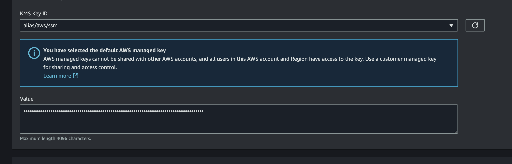

In our first part [**Using Github Container Registry to Store Helm Charts**](https://elposhox.dev/posts/ghcr-helm-charts/), we ended up centralizing our Helm Charts in Github, but now what’s next?

The next step is to use them from ArgoCD to follow our beloved GitOps principles.

## Prerequisites
- Have followed the tutorial mentioned above or achieved "the same" in some way,
- **[External Secrets Operator](https://external-secrets.io/latest/)** (although it can be replaced with any equivalent like SOPS or Sealed Secrets).
- An instance of **ArgoCD running**.

## Generating a Token in Github
The first thing we need to do is go to Github, to the Personal Access Tokens section, and generate a [**Fine-grained Token**](https://github.com/settings/personal-access-tokens). Once there, click the `Generate new token` button.


Give the token a suitable name, in my case `Helm - ArgoCD`. For the `Owner`, it’s important to set the scope correctly. I’m using my Github organization (**ElPoshoX**), but you can use your user or any org you’re part of. Set the expiration time to **90 days** so you have to rotate it every 3 months for security.


For the repositories that can use the token, select **only** where the helm charts are centralized (you can expand the scope if needed), and in `Repository permissions` set `Contents` to `Read-only`.


Go to the bottom of the page and click **Generate Token**. Once generated, copy it to use later.


## Storing it Securely in Parameter Store
Personally, I really like the combination of [External Secrets Operator](https://external-secrets.io/latest/) (ESO) with [AWS SSM (Parameter Store)](https://docs.aws.amazon.com/systems-manager/latest/userguide/systems-manager-parameter-store.html), which allows you to manage sensitive information with GitOps principles.

For this, go to your AWS account and create a new secret in **Parameter Store**. For the name, I chose something easy to find, `/argocd/ghcr/token`. In `Description`, enter something appropriate, and for `Type`, select `Secure String`.


Paste the token you generated earlier in Github into `Value`, and finally click **Create Parameter**.



## Generating the Secret for ArgoCD
Once your token is safely stored in SSM, it’s time to generate a secret that ArgoCD can use, and we’ll do this declaratively.

As seen in the examples [here](https://argo-cd.readthedocs.io/en/stable/operator-manual/argocd-repo-creds-yaml/), the secret needs some particularities like **labels** and must be created in the **argocd** namespace, in this case using **ESO**. The following example summarizes how it would be used:

````yaml
# private-repo.yaml
apiVersion: external-secrets.io/v1beta1
kind: ExternalSecret
metadata:
  name: eso-argocd-private-gcr
  namespace: argocd
spec:
  secretStoreRef:
    name: external-secrets-operator-cluster-store
    kind: ClusterSecretStore
  target:
    name: argocd-private-gcr
    template:
      engineVersion: v2
      metadata:
          labels:
            argocd.argoproj.io/secret-type: repository
            app.kubernetes.io/name: argocd-private-gcr
            app.kubernetes.io/part-of: argocd
          annotations:
            managed-by: argocd.argoproj.io

      data:
        url: ghcr.io/elposhox
        name: GCR
        type: helm
        enableOCI: 'true'
        username: 'ElPoshoX'
        password: '{{ .ghcr_token }}'

  data:
  - secretKey: ghcr_token
    remoteRef:
      key: /argocd/ghcr/token
````

One of the most important parts is the `data` section, where we assign the name `ghcr_token` (getting the value from `/argocd/ghcr/token`) and use it above in `password: '{{ .ghcr_token }}'`. Likewise, we use `argocd.argoproj.io/secret-type: repository` to make this **source** available as a **repository** type, and finally, the `url` where the Helm charts we previously hosted will be (our Github Packages URL).

## Applying the Manifest
A simple step: once the above file is created, run the command `kubectl apply -f private-repo.yaml` and the secret should be created in your cluster.


## Syncing and Verifying
Once this is done and ArgoCD is synced, you can go to **Settings > Repositories** and you’ll see your repository pointing to Github Container Registry with Helm enabled.


## Using our Helm Chart in ArgoCD
Finally, deploy an application using your Helm Chart and a source, as shown below:


And that’s it! You’ll see your application deploys without any issues.

Hope this was helpful!