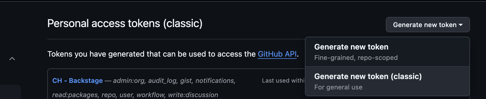
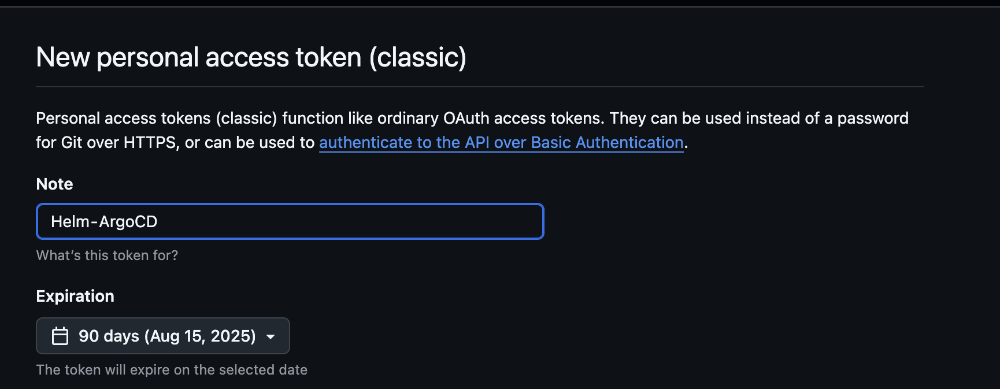
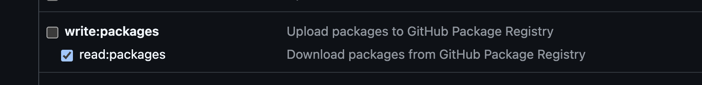
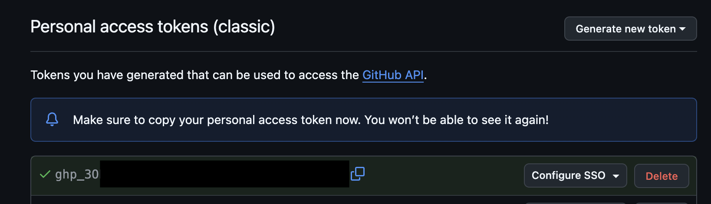
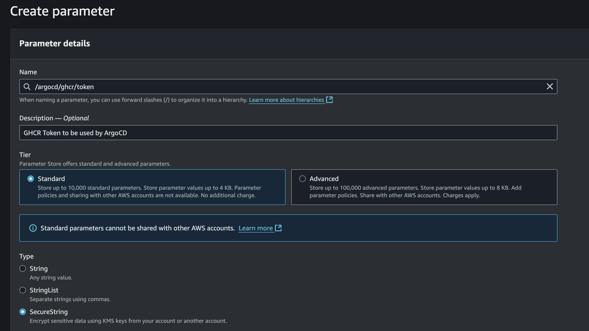
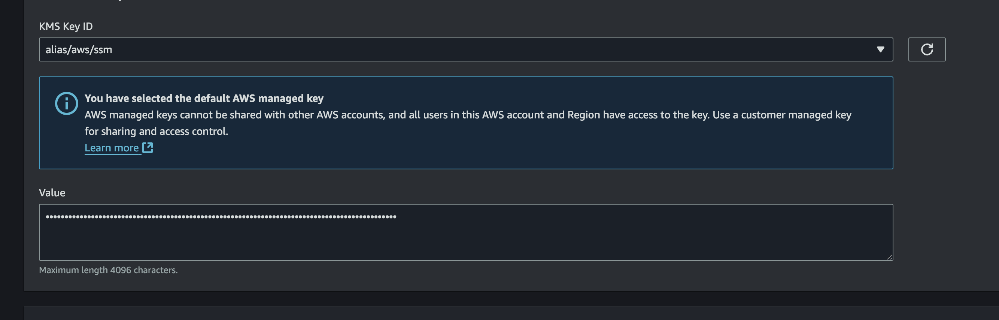
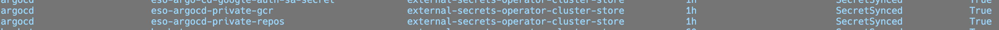
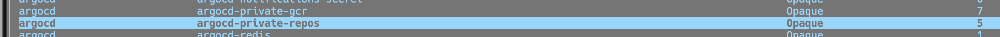
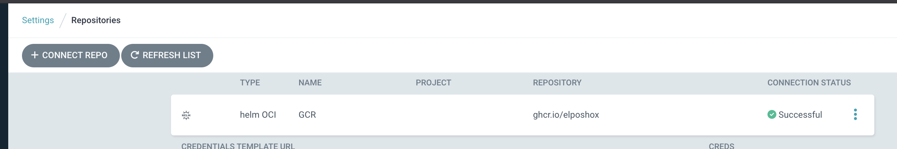
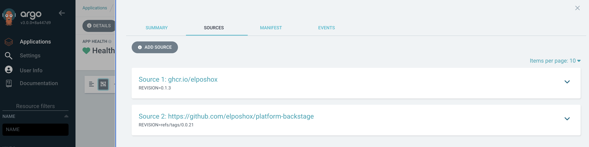

En nuestra primera parte [**Usando Github Container Registry para almacenar Helm Charts**](https://elposhox.dev/posts/ghcr-helm-charts/), terminamos centralizando nuestros Helm Charts en Github, pero ahora ¿que sigue?.

Lo que sigue, es poder usarlos desde ArgoCD para seguir nuestros tan queridos principios de GitOps.

## Prerrequisitos
- Haber seguido el tutorial mencionado más arriba o haber logrado "lo mismo" de alguna forma,
- **[External Secrets Operator](https://external-secrets.io/latest/)** (aun que puede ser reemplazado con cualquier otro equivalente como SOPS o Sealed Secrets).
- Una instancia de **ArgoCD corriendo**.

## Generando un token en Github
Lo primero que necesitamos es ir a Github a la sección de Personal Access Tokens y generar un [**Personal Access Token (Classic)**](https://github.com/settings/personal-access-tokens). Una vez ahí damos click en el botón de `Generate new token`.


**Nota!** Estamos usando PAT en lugar de Fine-Grained Tokens dado que estos últimos no soportan acceso a Github Packages, ese detalle se encuentra [aquí](https://docs.github.com/en/authentication/keeping-your-account-and-data-secure/managing-your-personal-access-tokens#fine-grained-personal-access-tokens-limitations)




Le damos un nombre acorde al token que en mi caso es `Helm - ArgoCD` y ajustamos el tiempo de expiración a **90 días**, así tenemos que rotarlo cada **3 meses** por seguridad.



En cuanto a los scopes, marcamos el de `read:packages`, que es el que necesitamos para poder leer los paquetes y seleccionamos el botón de `Generate token`.



Una vez generado, procedemos a copiarlo para usarlo más adelante.




## Almacenándolo de manera segura en Parameter Store
Personalmente me gusta mucho la combinación de [External Secrets Operator](https://external-secrets.io/latest/) (ESO) con [AWS SSM (Parameter Store)](https://docs.aws.amazon.com/systems-manager/latest/userguide/systems-manager-parameter-store.html), lo cual permite manejar información sensible con los principios de GitOps.

Para esto vamos a nuestra cuenta de AWS, y vamos a crear un nuevo secreto en **Parameter Store**. En nombre decidí usar uno fácil de encontrar, `/argocd/ghcr/token`, en `Description` ingresamos algo acorde, y en `Type`, seleccionamos `Secure String`.



Ingresamos el token que generamos previamente en Github y lo pegamos en `Value`, finalmente damos click en **Create Parameter**.



## Generando el secreto para ArgoCD
Una vez tengamos seguro nuestro token en SSM, nos toca generar un secreto que pueda ser usado por ArgoCD, para ello vamos a hacer uso de la manera declarativa.

Como apreciamos en los ejemplos por [acá](https://argo-cd.readthedocs.io/en/stable/operator-manual/argocd-repo-creds-yaml/), el secreto necesita algunas particularidades como son **labels** y crearse sobre el namespace de **argocd**, en este caso, usando **ESO**. El siguiente ejemplo resume como se usaría:

````yaml
# private-repo.yaml
apiVersion: external-secrets.io/v1beta1
kind: ExternalSecret
metadata:
  name: eso-argocd-private-gcr
  namespace: argocd
spec:
  secretStoreRef:
    name: external-secrets-operator-cluster-store
    kind: ClusterSecretStore
  target:
    name: argocd-private-gcr
    template:
      engineVersion: v2
      metadata:
          labels:
            argocd.argoproj.io/secret-type: repository
            app.kubernetes.io/name: argocd-private-gcr
            app.kubernetes.io/part-of: argocd
          annotations:
            managed-by: argocd.argoproj.io

      data:
        url: ghcr.io/elposhox
        name: GCR
        type: helm
        enableOCI: 'true'
        username: 'ElPoshoX'
        password: '{{ .ghcr_token }}'

  data:
  - secretKey: ghcr_token
    remoteRef:
      key: /argocd/ghcr/token
````

Una de las partes más importantes, es la sección de `data`, donde le asignamos el nombre de `ghcr_token` (obteniendo el valor desde `/argocd/ghcr/token`) y lo usamos en la sección más arriba, en `password: '{{ .ghcr_token }}'`,  de igual manera usamos `argocd.argoproj.io/secret-type: repository` para disponibilizar ese **source** de tipo **repositorio** y finalmente, la `url` donde estarán los helm charts que hemos alojado previamente (nuestra url de Github Packages).

## Aplicando el manifiesto
Paso simple, una vez creado el archivo anterior, procedemos a ejecutar el comando `kubectl apply -f private-repo.yaml` y el secreto deberá estar creado en nuestro cluster.





## Sincronizando y verificando
Una vez hecho esto y que ArgoCD esté sincronizado, podemos ir a **Settings > Repositories** y veremos ahí nuestro repositorio apuntando a Github Container Registry con Helm activado.



## Usando nuestro Helm Chart en ArgoCD
Para finalizar, desplegamos una aplicación usando nuestro Helm Chart y algún source, como se aprecia más abajo:



Y esto sería todo! Veremos que nuestra aplicación despliega sin problema.

Espero les haya servido!