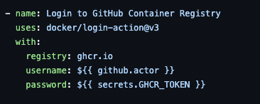
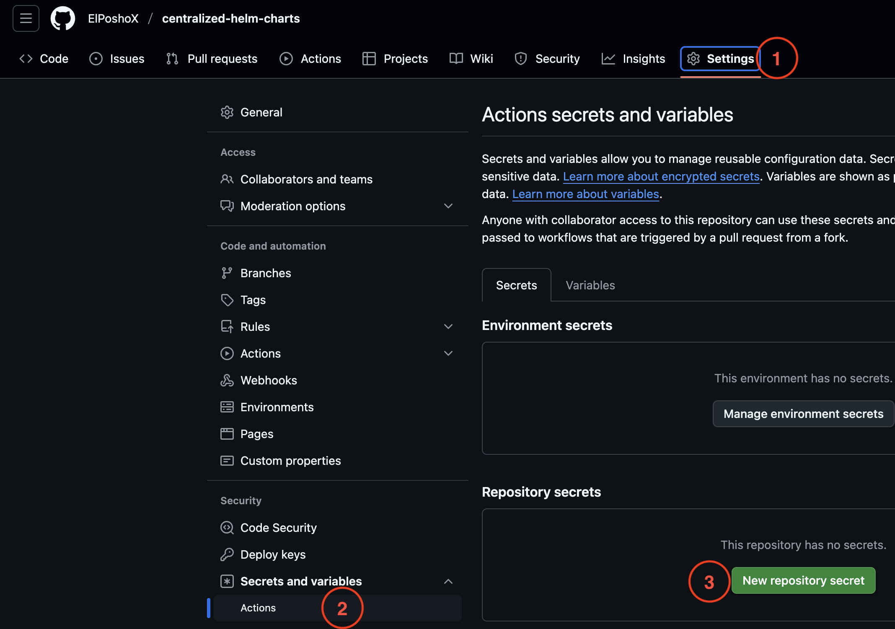
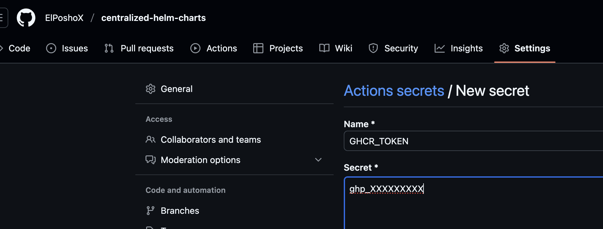
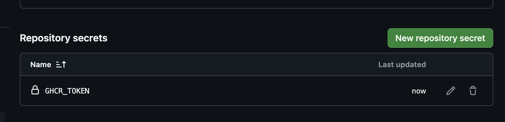
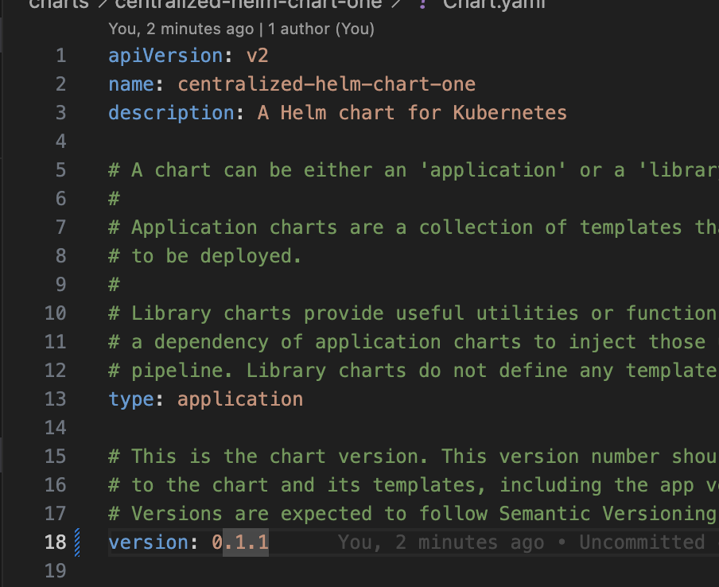
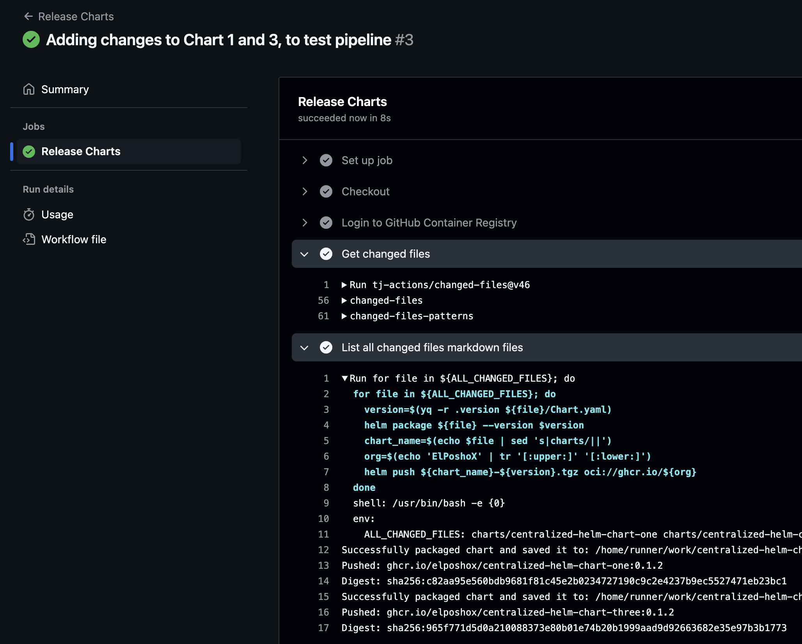


In the effort that I personally call “standardize and win” it was time to talk about GHCR (Github Container Registry) and Helm Charts.


In general I think that a good way to achieve standardization is a central repository in Github with a folder inside called charts, which in turn stores the definitions of the same. Having this mono repo scheme allows this to be the source of truth for the operating team, and likewise the development or product team always know where to look.

 You can do exactly the same as in this article if you have your charts in a 1:1 scheme (one chart per repo). 


## Prerrequisitos
- Helm
- A Personal Access Token (PAT) from Github with `write:packages` permissions.

## Estructura del repositorio
As mentioned before, the mono repo hosts everything centrally, an example of which can be found in [this example](https://github.com/ElPoshoX/centralized-helm-charts).

````bash
tree
.
└── .github
│   ├── workflows
│   │   ├── release.yaml
└── charts
    ├── centralized-helm-chart-one
    │   ├── ...
    ├── centralized-helm-chart-three
    │   ├── ...
    └── centralized-helm-chart-two
    │   ├── ...
````

What we can appreciate is that the scheme is respected, we have our **charts** folder and in it we have 3 (they have nothing particular, they are skeletons created with the helm CLI).
In the same way we have a file `.github/workflows/release.yaml` with the definition of a pipeline that will help us to automate the task.

## Preparring the secrets
If we explore the `release.yaml` file, we will notice that it needs one with the name `GHCR_TOKEN`.



So that our pipeline can use it, we will go to the `Settings` of the repository as shown in the picture and once there select "New repository secret".






Once there we assign the name `GHCR_TOKEN`, paste our PAT and that's it.




## Workinf the charts
With this ready, and to see that everything works, we proceed to modify two of the three charts and upgrade them.

 If you pushed the files and then continue with the modification, the pipeline will generate a first version 

For this I just added a few blank lines in some files and modified the Chart.yaml as seen below.





Without further ado, we make the push to the repository, and we will notice that we have a pipeline execution, in the detail we can explore that only a new version was generated for **chart 1** and **3** (the same ones we modified).

")



")


## Closing up
As we could see, the charts were generated without any problem. Something I forgot to mention is that the charts stored in GHCR are OCI Compliant which gives us advantages such as standardization and interoperability to be used in larger ecosystems, for example, using these Helm Charts with a GitOps practice using tools like ArgoCD.

In another article later we will see just this case; meanwhile, see ya!