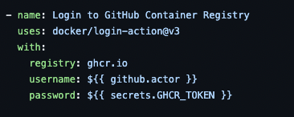
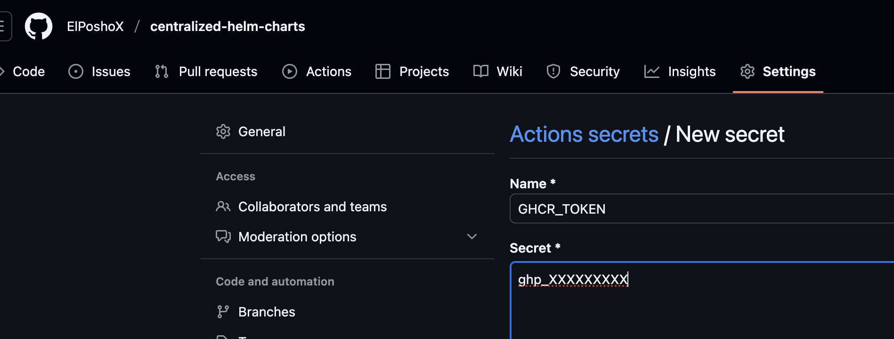
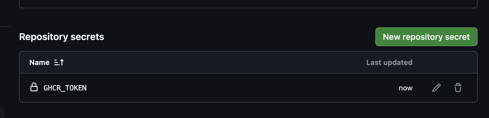
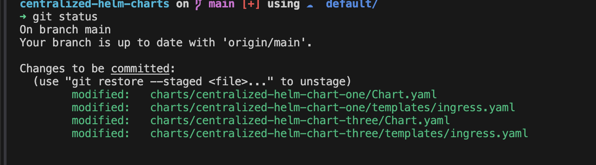
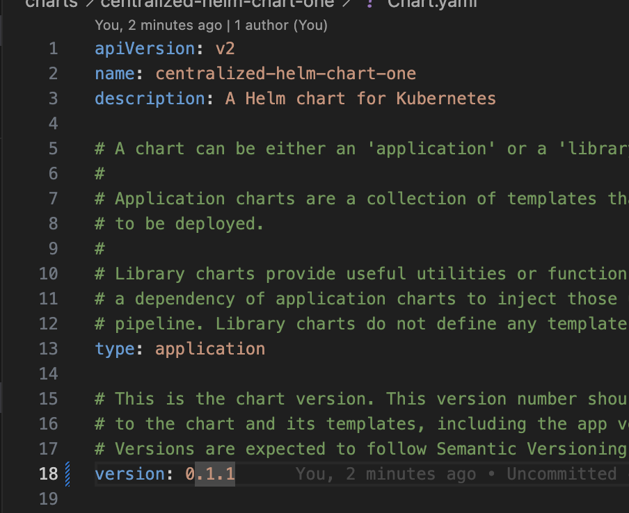


En el esfuerzo que personalmente le llamo "estandarizar y ganar" llegó el momento de hablar de GHCR (Github Container Registry) y los Helm Charts


En general considero que una buena manera de lograr la estandarización es un repositorio central en Github con una carpeta dentro llamada charts, que a su vez almacene las definiciones de los mismos. El tener este esquema de mono repo permite que esta sea la fuente de la verdad para el equipo que opera, y de igual manera el equipo de desarrollo o producto sepan siempre donde buscar.

 Se puede hacer exactamente lo mismo de este articulo si tienes tus charts en un esquema de 1:1 (un chart por repo). 


## Prerrequisitos
- Helm
- Un Personal Access Token (PAT) de Github con permisos de `write:packages`.

## Estructura del repositorio
Como mencionábamos antes, el mono repo alberga todo de manera centralizada, un ejemplo de ello se encuentra en [este ejemplo](https://github.com/ElPoshoX/centralized-helm-charts).

````bash
tree
.
└── .github
│   ├── workflows
│   │   ├── release.yaml
└── charts
    ├── centralized-helm-chart-one
    │   ├── ...
    ├── centralized-helm-chart-three
    │   ├── ...
    └── centralized-helm-chart-two
    │   ├── ...
````

Lo que podemos apreciar es que se respeta el esquema, tenemos nuestra carpeta de **charts** y en ella tenemos 3 (no tienen nada de particular, son esqueletos creados con el CLI de helm).
De igual manera tenemos un archivo `.github/workflows/release.yaml` con la definición de un pipeline que nos ayudará a automatizar la tarea.

## Preparando los secretos
Si exploramos el archivo de `release.yaml`, vamos a notar que necesita uno con el nombre de `GHCR_TOKEN`.



Para que nuestro pipeline pueda usarlo, nos vamos a ir a los `Settings` del repositorio como se muestra en la foto y una vez ahí seleccionar "New repository secret".




Una vez ahí le asignamos el nombre `GHCR_TOKEN`, pegamos nuestro PAT y listo.




## Trabajando los charts
Con esto listo, y para ver que todo funciona, procedemos a modificar dos de los tres charts y subirlos de versión.

 Si hiciste push de los archivos y después sigues con la modificación, el pipeline va a generar una primera versión 

Para ello solo añadí unas lineas en blanco en algunos archivos y modifiqué el Chart.yaml como se ve aquí abajo.






Sin más, hacemos el push hacia el repositorio, y vamos a notar que tenemos une ejecución del pipeline, en el detalle podemos explorar que solo se generó una nueva versión para el **chart 1** y **el 3** (los mismos que modificamos).

")


")


## Cerrando
Como pudimos apreciar, los charts fueron generados sin ningún problema. Algo que se me olvidó mencionar es que los charts guardados en GHCR son OCI Compliant por lo cual nos da ventajas como la estandarización y interoperabilidad para ser usados en ecosistemas más grandes, por ejemplo, usar estos Helm Charts con una práctica de GitOps usando herramientas como ArgoCD.

En otro articulo más adelante veremos justo este caso; mientras tanto, un saludo!