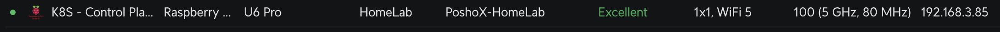
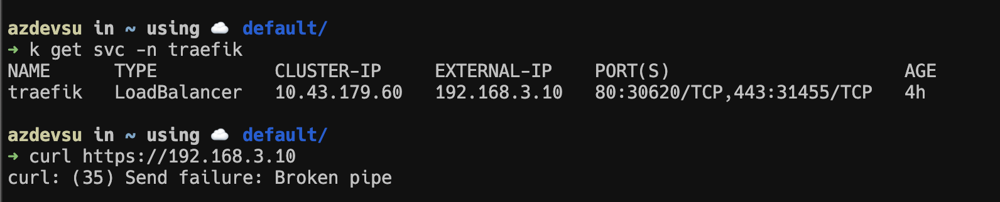
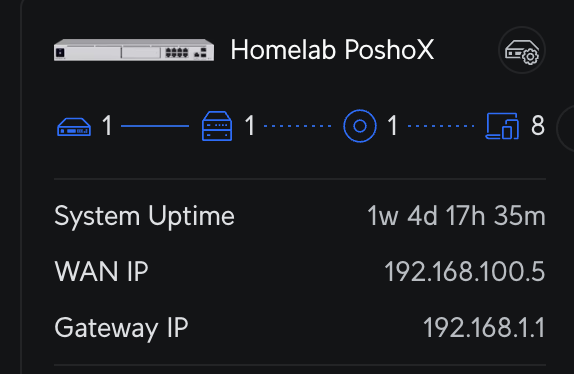
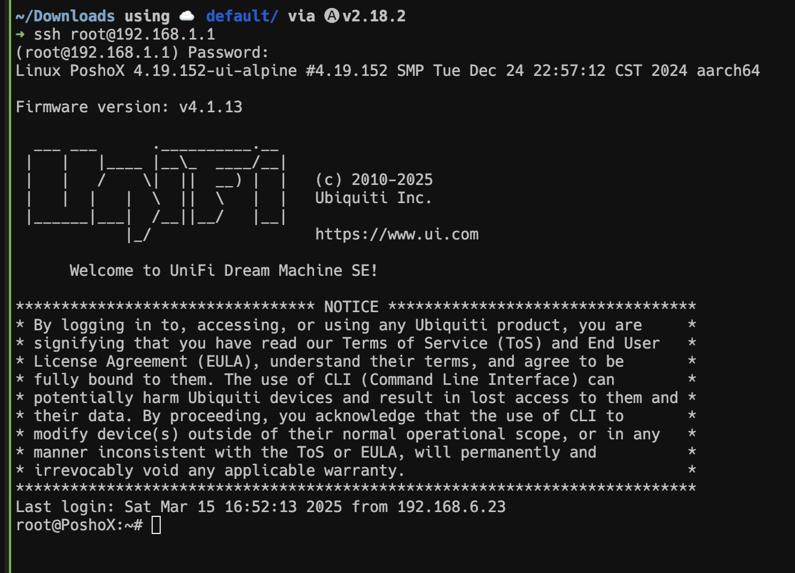
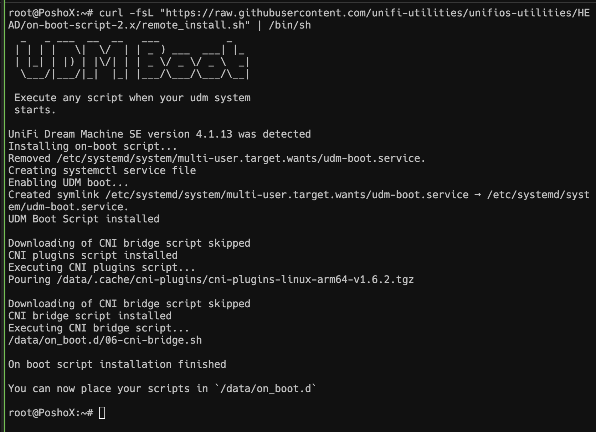
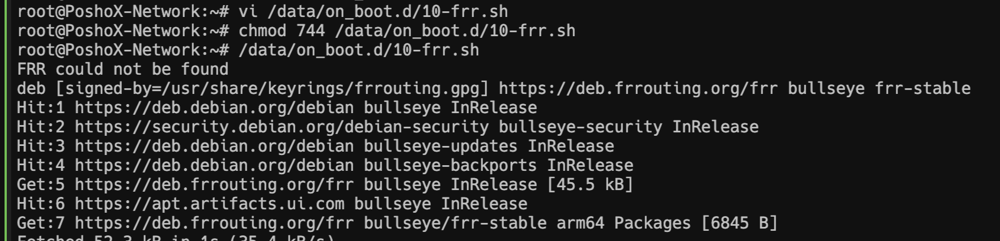
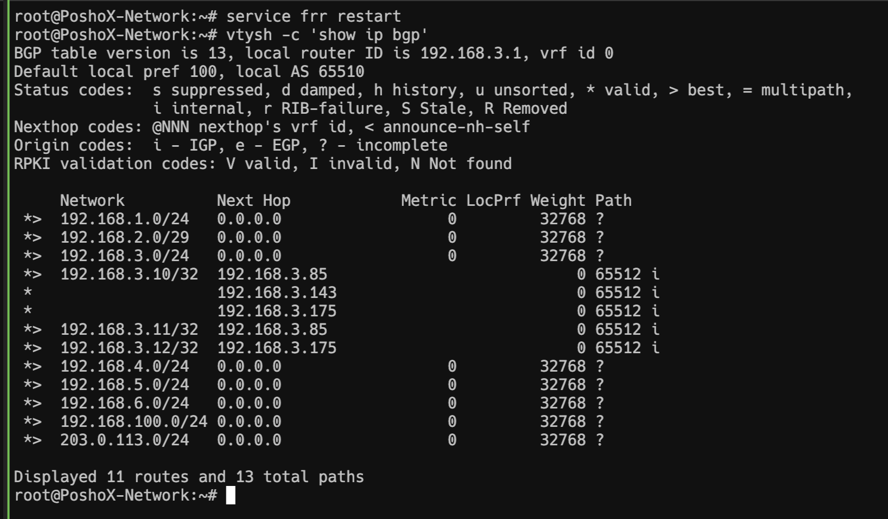
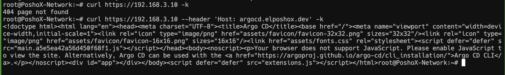


Segregating our network and making it properly available.


## Considerations
Just to keep in mind, this homelab is running:
- **[K3S](https://k3s.io/)** with 3 nodes
- **[MetalLB](https://metallb.io/)** - **[Traefik](https://doc.traefik.io/traefik/providers/kubernetes-ingress/)** as Ingress Controller

## What's the problem?

In this series of events, it's definitely time to talk about network segregation. For many people, this is not relevant and they prefer to leave everything on the network created by their Internet Service Provider (ISP), but in our case, we like to complicate things lol.

As a router at home, I have a [Unifi Dream Machine Special Edition](https://mx.store.ui.com/mx/es/category/cloud-gateways-large-scale/products/udm-se) with **8 GbE ports**, 6 of them with **PoE** and 2 with **PoE+**. On it, I have 4 networks called **Secured**, **IoT**, **HomeLab**, and **Guest**.


As we can deduce, the lab network is the one called **HomeLab** where my K3S and Proxmox cluster lives, but **here's the problem:** everything works fine within that network and all devices can reach each other.
Things change when I'm on the **Secured** network. With the correct firewall rules, I can reach the Kubernetes and Proxmox nodes, however, **I cannot reach the applications** exposed using either their **Load Balancer** service or their **IngressRoute**, which is part of Traefik. **That's the big problem**: the routes to those IPs are not exposed outside the cluster.





## How to solve it?
To "publish" those IPs and their routes outside our **VLAN**, we will use a routing protocol. **BGP (Border Gateway Protocol)** is a standardized exterior gateway protocol designed to exchange routing information among autonomous systems (AS) on the Internet. It can be used in networks that include VLANs to improve network management and performance, which can be useful for properly segmenting the network and allowing or denying traffic between different VLANs using Layer 3 devices like routers or multilayer L3 switches.

In my case, the **UDM SE** runs on Unifi OS V4.x, and although it has native support from the GUI, I prefer to achieve it from the router console.

### Turn on Router SSH
By default, this is turned off, so we need to enable it before entering. To do this, we go to the **Settings > Control Plane > Console** section and enable the **SSH** checkbox. Once this is done, we click on **"Change Password"** to assign the password we will use to log in.


With that configured, and before proceeding, we note the gateway router's IP, which we can see here.



### Connect to UDM via SSH
In the terminal, we run `ssh root@192.168.1.1` (the IP must be the one we noted previously), enter the password, and we'll be in.



### Configure On-Boot Script
As part of the [unifios-utilities](https://github.com/unifi-utilities/unifios-utilities) library, we have the [On-Boot](https://github.com/unifi-utilities/unifios-utilities/blob/main/on-boot-script-2.x/README.md) script, which, as its name suggests, is used to load configurations to the UDM when it undergoes a restart or even when a firmware update is performed.

To do this, in our terminal within the UDM, we will run `curl -fsL "https://raw.githubusercontent.com/unifi-utilities/unifios-utilities/HEAD/on-boot-script-2.x/remote_install.sh" | /bin/sh`. Once finished, we can proceed to install FRR.



### Installing Free Range Routing
Free Range Routing (FRR) is a suite of open-source Internet routing protocols for Linux and Unix platforms. FRR basically allows you to manage the network efficiently, connecting hosts, virtual machines, and containers to the network, announcing network services, and performing routing and switching on the LAN.

To do this, we will execute `vi /data/on_boot.d/10-frr.sh` and within the file, we will paste the following.


````bash
#!/bin/bash

# If FRR is not installed then install and configure it
if ! command -v /usr/lib/frr/frrinit.sh &> /dev/null; then
    echo "FRR could not be found"
    rm -f /etc/apt/sources.list.d/frr.list
    # Add GPG key
    curl -s [https://deb.frrouting.org/frr/keys.gpg](https://deb.frrouting.org/frr/keys.gpg) | sudo tee /usr/share/keyrings/frrouting.gpg > /dev/null

    # Using latest stable version
    FRRVER="frr-stable"
    echo deb '[signed-by=/usr/share/keyrings/frrouting.gpg]' [https://deb.frrouting.org/frr](https://deb.frrouting.org/frr) \
    $(lsb_release -s -c) $FRRVER | sudo tee -a /etc/apt/sources.list.d/frr.list

    apt-get update && apt-get -y install frr frr-pythontools
    if [ $? -eq 0 ]; then
        echo "Installation successful, updating configuration"
        echo > /etc/frr/vtysh.conf
        rm -f /etc/frr/frr.conf
        chown frr:frr /etc/frr/vtysh.conf
    fi
    service frr restart
fi
````

Once saved, we assign execution permissions with `chmod 744 /data/on_boot.d/10-frr.sh` and finally, we proceed to execute the script using `/data/on_boot.d/10-frr.sh`. When it finishes, we will be ready to configure.



When everything is ready, we need to activate the `bgpd daemon`.

### Activating bgpd
To activate the `daemon` that corresponds to `bgpd`, we will execute `vi /etc/frr/daemons` and in our editor, we will change the following value from `bgpd=no` to `bgpd=yes`. We save and proceed to the last part.

````bash
...
# The watchfrr, zebra and staticd daemons are always started.
#
bgpd=yes
ospfd=no
...
````

### Configuring the routes
As a final step, it only remains to configure and announce the routes using BGP. For this, we can use the following template, where we will make slight changes. The first is the `password` section, which, although in this particular case since all the configuration is within the UDM, it doesn't hurt to have it. The second is the ASN (Autonomous System Number), which in this case is here `router bgp 65510`. We can change it, or leave it as it is. If you change it, just note it down for later use.

We also need to configure the VLAN Gateway IP, in my case `bgp router-id 192.168.3.1`. And finally, the neighbors, which are basically the "peers" we want to connect. In my case, they are 3 nodes that comprise the K3s cluster.

````bash
neighbor 192.168.3.85 peer-group ML
neighbor 192.168.3.143 peer-group ML
neighbor 192.168.3.175 peer-group ML
````

Here is the complete file with the mentioned modifications:

````bash
! -*- bgp -*-
!
hostname $UDMP_HOSTNAME
password xxxxxxxxx
frr defaults traditional
log file stdout
!
router bgp 65510
 bgp ebgp-requires-policy
 bgp router-id 192.168.3.1
 maximum-paths 1
 !
 ! Peer group for MetalLB
 neighbor ML peer-group
 neighbor ML remote-as 65512
 neighbor ML activate
 neighbor ML soft-reconfiguration inbound
 neighbor ML timers 15 45
 neighbor ML timers connect 15
 ! Neighbors for MetalLB
 neighbor 192.168.3.85 peer-group ML
 neighbor 192.168.3.143 peer-group ML
 neighbor 192.168.3.175 peer-group ML

 address-family ipv4 unicast
  redistribute connected
  !
  neighbor DNS activate
  neighbor DNS route-map ALLOW-ALL in
  neighbor DNS route-map ALLOW-ALL out
  neighbor DNS next-hop-self
  !
  neighbor ML activate
  neighbor ML route-map ALLOW-ALL in
  neighbor ML route-map ALLOW-ALL out
  neighbor ML next-hop-self
 exit-address-family
 !
route-map ALLOW-ALL permit 10
!
line vty
!
````

After saving the changes, we proceed to restart the service using `service frr restart` and finally, to see the propagated routes, we execute `vtysh -c 'show ip bgp'`, which will show us our VLANs, as well as the IPs of the nodes, and those of the Kubernetes `services` (in my case, 192.168.3.10 is the Traefik service, which acts as a reverse proxy).



## How do we test?
How about we try again the curl that was failing? We execute `curl https://192.168.3.10` and what we can see is that it responds with a 404, which is perfect! Doing the same, but passing a host header so the `ingress route` of Traefik can respond, we see that as expected, we can reach it without a problem!



This is the end of our article, thank you very much for stopping by and I hope it has helped you!