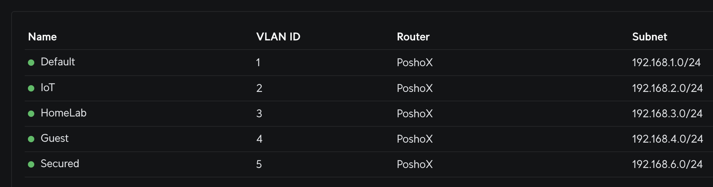
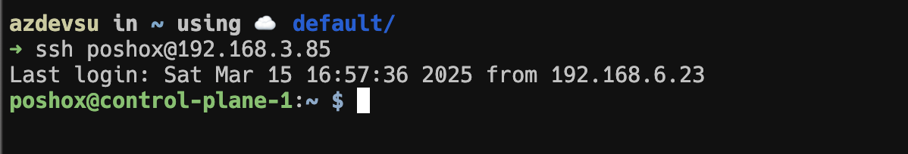
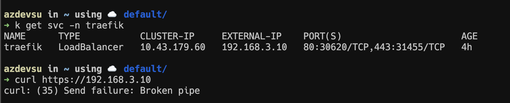
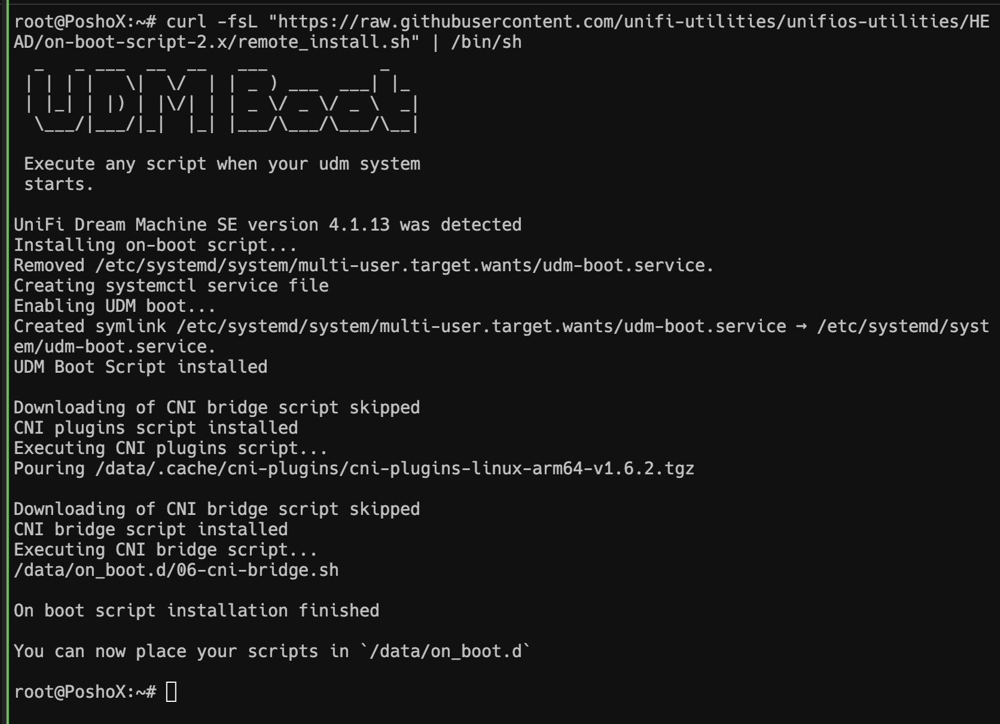
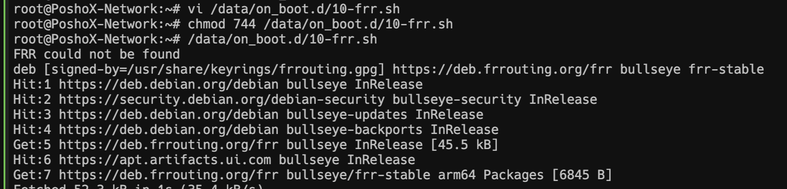
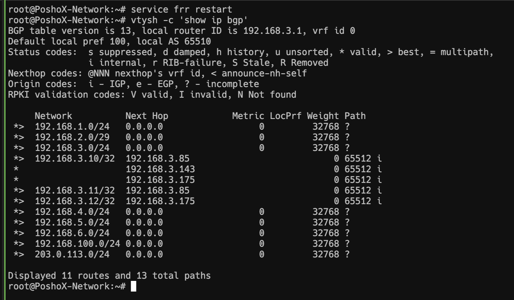
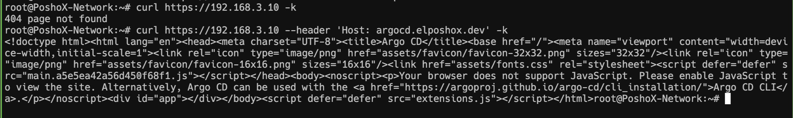


Segregando y disponibilizando nuestra red de manera correcta.


## Consideraciones
Solo para tenerlo en cuenta, este homelab está corriendo:
- **[K3S](https://k3s.io/)** con 3 nodos
- **[MetalLB](https://metallb.io/)** 
- **[Traefik](https://doc.traefik.io/traefik/providers/kubernetes-ingress/)** como Ingress Controller


## ¿Cuál es el problema?

Dentro de esta serie de acontecimientos toca sin duda hablar sobre la parte de segregar la red. Para mucha gente esto no es relevante y prefieren dejar todo en la propia red que crea su proveedor de internet (ISP), pero en nuestro caso, nos gusta complicarnos las cosas lol.

Como router en casa tengo un [Unifi Dream Machine Special Edition](https://mx.store.ui.com/mx/es/category/cloud-gateways-large-scale/products/udm-se) con **8 puertos GbE** 6 de ellos con **PoE** y 2 de con **PoE+**. En él, tengo 4 redes llamadas **Secured**, **IoT**, **HomeLab** y **Guest**.



Como podemos deducir, la red del laboratorio es la llamada **HomeLab** donde mi cluster de K3S y Proxmox vive, pero **aquí viene el problema** todo funciona bien dentro de esa red y todos los dispositivos se alcanzan entre ellos.
La cosa cambia cuando estoy desde la red **Secured**, con las reglas correctas de firewall, puedo alcanzar los nodos de Kubernetes y los de Proxmox, sin embargo, **no puedo alcanzar las aplicaciones** expuestas usando ni su **servicio** de tipo **Load Balancer**, ni tampoco usando su **IngressRoute** que es parte de Traefik. **Ese es el gran problema**, las rutas hacia esas IPs no son expuestas fuera del cluster.






## ¿Cómo Solucionarlo?
Para "publicar" esas IPs y sus rutas fuera de nuestro **VLAN** nos apoyaremos en un protocolo de enrutamiento . El **BGP (Border Gateway Protocol)** es un protocolo de enrutamiento estandarizado diseñado para intercambiar información de enrutamiento entre sistemas autónomos (AS). Puede utilizarse en redes que incluyen VLANs para mejorar la administración y el rendimiento de la red, lo que puede ser útil para segmentar adecuadamente la red y permitir o denegar el tráfico entre diferentes VLANs usando dispositivos de capa 3 como routers o switches multicapa L3.

En mi caso el **UDM SE** corre sobre Unifi OS V4.x, y aunque tiene soporte nativo desde la GUI, prefiero lograrlo desde la consola del router. 

### Encender el SSH del Router
Por defecto esto viene apagado, por lo cual necesitamos habilitarlo antes de entrar, para ello, vamos a ir a la sección de **Settings > Control Plane > Console** y habilitaremos el checkbox de **SSH**, una vez hecho esto, ahí mismo damos click donde dice **"Change Password"** para asignar la contraseña que vamos a usar para ingresar.


Con eso configurado, y antes de proseguir, anotamos la IP del gateway router, la cual podemos verla acá. 


### Conectarnos por SSH al UDM
En la terminal, ejecutamos `ssh root@192.168.1.1` (la ip debe ser la que anotamos previamente), ingresamos la contraseña y estaremos dentro.


### Configurar On-Boot Script
Como parte de la librería [unifios-utilities](https://github.com/unifi-utilities/unifios-utilities) tenemos el script de [On-Boot](https://github.com/unifi-utilities/unifios-utilities/blob/main/on-boot-script-2.x/README.md), el cual, como su nombre sugiere, sirve para cargar configuraciones al UDM cuando sufre algún reinicio o incluso cuando se realiza alguna actualización de firmware.

Para ello, en nuestra terminal dentro del UDM vamos a ejecutar `curl -fsL "https://raw.githubusercontent.com/unifi-utilities/unifios-utilities/HEAD/on-boot-script-2.x/remote_install.sh" | /bin/sh`. Una vez finalizado podemos proseguir a instalar FRR.



### Instalando Free Range Routing
Free Range Routing (FRR) es un conjunto de protocolos de enrutamiento de Internet open source para plataformas Linux y Unix. FRR básicamente permite gestionar la red de manera eficiente, conectando hosts, máquinas virtuales y contenedores a la red, anunciando servicios de red, realizando enrutamiento y conmutación en LAN.

Para ello, vamos a ejecutar `vi /data/on_boot.d/10-frr.sh` y dentro del archivo, vamos a pegar lo siguiente.

````bash
#!/bin/bash

# If FRR is not installed then install and configure it
if ! command -v /usr/lib/frr/frrinit.sh &> /dev/null; then
    echo "FRR could not be found"
    rm -f /etc/apt/sources.list.d/frr.list
    # Add GPG key
    curl -s https://deb.frrouting.org/frr/keys.gpg | sudo tee /usr/share/keyrings/frrouting.gpg > /dev/null

    # Using latest stable version
    FRRVER="frr-stable"
    echo deb '[signed-by=/usr/share/keyrings/frrouting.gpg]' https://deb.frrouting.org/frr \
    $(lsb_release -s -c) $FRRVER | sudo tee -a /etc/apt/sources.list.d/frr.list

    apt-get update && apt-get -y install frr frr-pythontools
    if [ $? -eq 0 ]; then
        echo "Installation successful, updating configuration"
        echo > /etc/frr/vtysh.conf
        rm -f /etc/frr/frr.conf
        chown frr:frr /etc/frr/vtysh.conf
    fi
    service frr restart
fi
````

Una vez guardado, le asignamos permisos de ejecución con `chmod 744 /data/on_boot.d/10-frr.sh` y por último procedemos a ejecutar el script mediante `/data/on_boot.d/10-frr.sh`, cuando termine, estaremos listos para configurar.



Cuando todo esté listo, nos toca activar el `daemon` de `bgpd`. 

### Activando bgpd
Para activar el `daemon` que corresponde a `bgpd` vamos a ejecutar `vi /etc/frr/daemons` y en nuestro editor, vamos a cambiar el siguiente valor de `bgpd=no` a `bgpd=yes`, guardamos y procedemos a la última parte.

````bash
...
# The watchfrr, zebra and staticd daemons are always started.
#
bgpd=yes
ospfd=no
...
````

### Configurando las rutas
Cómo último paso, solo queda configurar y anunciar las rutas mediante BGP, para ello, pudimos a usar la siguiente plantilla, donde vamos a hacer ligeros cambios. Lo primero es la sección de `password`, que si bien, en este caso en particular dado que toda la configuración es dentro del UDM, pero no está de más. La segunda es el ASN (Autonomous System Number) que en este caso está aquí `router bgp 65510`, podemos cambiarlo, o dejarlo como es, en caso de cambiarlo solo hay que anotarlo para usarlo más tarde.

Necesitamos configurar también el Gateway IP de la VLAN, en mi caso `bgp router-id 192.168.3.1`. Y por último los neighbors, que básicamente son los "peers" que queremos conectar, en mi caso son 3 nodos que comprenden el cluster de K3s.

````bash
neighbor 192.168.3.85 peer-group ML
neighbor 192.168.3.143 peer-group ML
neighbor 192.168.3.175 peer-group ML
````

Aquí el archivo completo con las modificaciones mencionadas:

````bash
! -*- bgp -*-
!
hostname $UDMP_HOSTNAME
password xxxxxxxxx
frr defaults traditional
log file stdout
!
router bgp 65510
 bgp ebgp-requires-policy
 bgp router-id 192.168.3.1
 maximum-paths 1
 !
 ! Peer group for MetalLB
 neighbor ML peer-group
 neighbor ML remote-as 65512
 neighbor ML activate
 neighbor ML soft-reconfiguration inbound
 neighbor ML timers 15 45
 neighbor ML timers connect 15
 ! Neighbors for MetalLB
 neighbor 192.168.3.85 peer-group ML
 neighbor 192.168.3.143 peer-group ML
 neighbor 192.168.3.175 peer-group ML

 address-family ipv4 unicast
  redistribute connected
  !
  neighbor DNS activate
  neighbor DNS route-map ALLOW-ALL in
  neighbor DNS route-map ALLOW-ALL out
  neighbor DNS next-hop-self
  !
  neighbor ML activate
  neighbor ML route-map ALLOW-ALL in
  neighbor ML route-map ALLOW-ALL out
  neighbor ML next-hop-self
 exit-address-family
 !
route-map ALLOW-ALL permit 10
!
line vty
!
````

Tras guardar los cambios, procedemos a reiniciar el servicio mediante `service frr restart` y por último, para ver las rutas propagadas ejecutamos `vtysh -c 'show ip bgp'` lo cual nos mostrará nuestras vlans, así como las ips de los nodos, y la de los `services` de kubernetes (en mi caso la 192.168.3.10 es la del servicio de traefik, que actúa como proxy reverso).



## ¿Cómo probamos?
¿Qué tal si probamos de nuevo el curl que fallaba? Ejecutamos un `curl https://192.168.3.10` y lo que podemos ver es que nos responde un 404, lo cual está perfecto! Haciendo lo mismo pero, pasándole un host header para que el `ingress route` de **traefik** pueda responder, vemos que en efecto, podemos alcanzarlo sin problema!



Hasta aquí es todo nuestro articulo, muchas gracias por pasar y espero te haya ayudado!