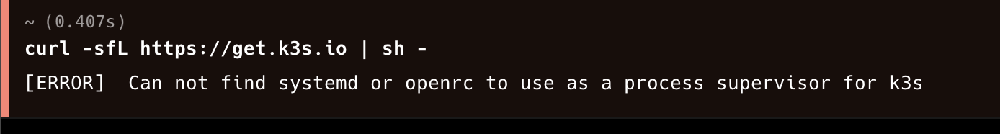
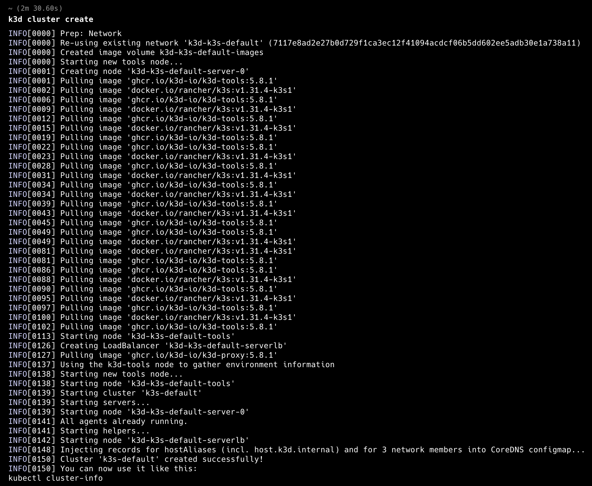
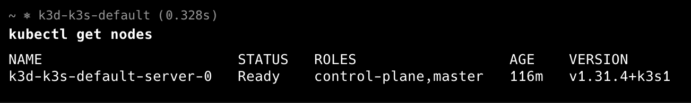
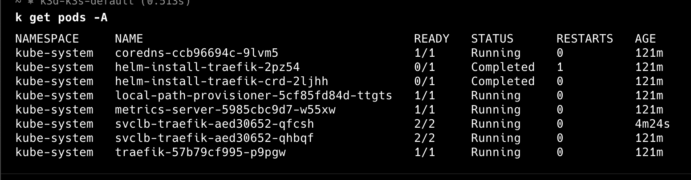


Desbloqueando el potencial del Edge Computing y más allá


## ¿Qué es K3s? Un Vistazo Profundo a su Arquitectura y Filosofía

**K3s es una distribución de Kubernetes totalmente compatible, pero con una huella de memoria y un tamaño de instalación mucho menores que su contraparte K8s**. Se distingue por ser **empaquetada como un único binario de menos de 100 MB**, lo que facilita su instalación y despliegue. Esta característica es crucial para su versatilidad, permitiendo su uso en escenarios que van desde **dispositivos al borde de la red (edge computing)** hasta **entornos de desarrollo local**.

**K3s fue creada por Rancher**, con el objetivo de ofrecer una solución de Kubernetes que fuera fácil de manejar, **incluso para aquellos sin una vasta experiencia en la gestión de clusteres**. La frase "situaciones donde un doctorado en clusterología de K8s es inviable" resume perfectamente esta filosofía: **K3s busca eliminar las barreras de entrada a Kubernetes**, permitiendo a más desarrolladores y organizaciones aprovechar su potencial.


## Casos de Uso Clave

La versatilidad de K3s la convierte en una opción atractiva para una amplia gama de aplicaciones:

*   **Edge Computing:** Implementa aplicaciones en dispositivos cerca de la fuente de datos, reduciendo la latencia y mejorando el rendimiento en tiempo real. Esto es crucial para aplicaciones de IoT, análisis de video en tiempo real y sistemas de control industrial.
*   **Internet de las Cosas (IoT):** Gestiona aplicaciones en dispositivos con recursos limitados, desde sensores hasta dispositivos domésticos inteligentes. K3s permite desplegar y actualizar aplicaciones de forma remota en estos dispositivos de manera eficiente.
*   **Laboratorios Caseros (Homelab):** Ofrece una forma sencilla y eficiente de experimentar con Kubernetes sin la sobrecarga de un cluster completo, ideal para estudiantes, entusiastas y desarrolladores que buscan aprender y experimentar con esta tecnología.
*   **Integración Continua (CI):** Proporciona un entorno consistente para pruebas y desarrollo, acelerando el ciclo de vida del software. K3s permite crear entornos de prueba de manera rápida y sencilla, facilitando la detección temprana de errores.
*   **Desarrollo Local:** Permite a los desarrolladores trabajar con Kubernetes de manera local y sencilla, sin la necesidad de una infraestructura compleja. Esto agiliza el desarrollo y las pruebas de aplicaciones basadas en contenedores.
*   **Dispositivos ARM y Placas de un Solo Circuito:** Es totalmente compatible con arquitecturas ARM, como las de Raspberry Pi, abriendo un mundo de posibilidades para proyectos de electrónica y robótica.
*   **Entornos Aislados (Air-gapped):** Funciona en entornos sin conexión a internet, ideal para situaciones de alta seguridad donde el acceso a la red es limitado o inexistente.
*   **Sistemas Embebidos:** Se integra fácilmente en otras aplicaciones y sistemas, permitiendo la gestión de aplicaciones en contenedores en una variedad de contextos.

## Características Técnicas: Desglosando la Potencia de K3s

### Diseño y Arquitectura Minimalista

*   **Un Solo Binario:** **K3s se distribuye como un único binario ejecutable o una imagen de contenedor mínima**, lo que simplifica enormemente su instalación y gestión. Esta característica reduce la complejidad de despliegue y facilita la automatización.
*   **Datastore Ligero:** Utiliza **sqlite3 como almacenamiento de datos por defecto**, ideal para entornos de baja demanda. Sin embargo, para clusteres más grandes o para aquellos que requieren una mayor resiliencia, **también soporta etcd3, MySQL y Postgres**.
*   **Launcher Simplificado:** Incorpora un launcher que **gestiona la complejidad de TLS (Transport Layer Security)** y otras opciones de configuración, automatizando muchas de las tareas de configuración que en Kubernetes tradicional serían manuales.
*   **Componentes Encapsulados:** **Todos los componentes del plano de control de Kubernetes (API Server, Scheduler, Controller Manager) están encapsulados en un único proceso**, simplificando la operación y automatizando tareas como la distribución de certificados. Esto reduce la sobrecarga de recursos y mejora la estabilidad.

### Ventajas Clave

* **Seguridad por Defecto:** Viene configurado con valores predeterminados seguros para entornos ligeros, minimizando el riesgo de vulnerabilidades y simplificando la configuración de seguridad.
* **Dependencias Mínimas:** Requiere un kernel moderno y montajes cgroup, reduciendo la necesidad de dependencias externas y facilitando su despliegue en diferentes sistemas operativos.
* **"Baterías Incluidas":** K3s incluye todas las dependencias necesarias para la creación fácil de clusteres:
    *   **containerd/cri-dockerd:**  Runtime de contenedores.
    *   **Flannel:** Interfaz de red de contenedores (CNI).
    *   **CoreDNS:** DNS del cluster.
    *   **Traefik:** Controlador de ingreso.
    *   **ServiceLB:** Controlador de balanceo de carga.
    *   **Kube-router:** Controlador de política de red.
    *   **local-path-provisioner:** Controlador de volúmenes persistentes.
    *   **Spegel:** Mirror de registro de imágenes de contenedor distribuido.
    *   **Utilidades del host:**  `iptables`, `socat`, entre otras.
* **Uso eficiente de recursos**: K3s utiliza la mitad de la memoria que K8s, lo cual la hace ideal para ambientes con recursos limitados.

### Comparación con Kubernetes (K8s)

Si bien K3s comparte el núcleo de Kubernetes, existen diferencias importantes:

| Característica           | Kubernetes (K8s)                                                                      | K3s                                                                                                                                 |
| ------------------------- | ------------------------------------------------------------------------------------ | ----------------------------------------------------------------------------------------------------------------------------------- |
| **Tamaño**                | Grande, múltiples componentes                                                       | Pequeño, un único binario menor a 100MB                                                                         |
| **Complejidad**           | Alta, múltiples componentes y configuraciones                                         | Baja, configuración sencilla, ideal para principiantes y entornos con recursos limitados                                            |
| **Uso de Memoria**        | Alto                                                                                   | Bajo, utiliza la mitad de la memoria que K8s                                                                                 |
| **Base de Datos**         | Generalmente `etcd`, distribuida y compleja                                        | `sqlite3` por defecto, con soporte para `etcd3`, `MySQL` y `Postgres` para mayor escalabilidad                               |
| **Ideal para**            | Grandes despliegues, alta disponibilidad, entornos complejos y aplicaciones críticas   | Entornos de borde, IoT, desarrollo local, laboratorios caseros, pruebas, dispositivos con recursos limitados   |
| **Escalabilidad**         | Alta                                                                                   | Moderada, aunque se puede usar para sistemas distribuidos con la base de datos adecuada                                                                       |
| **Base de Datos Distribuida** | Incluida de forma nativa                                                            | No incluida de forma nativa, se debe usar la solución `Dqlite` de Rancher si se desea una base de datos distribuida                   |

## El Nombre K3s: Un Acrónimo con Historia

El nombre "**K3s**" es un homenaje a Kubernetes (K8s), donde la "K" es la primera letra y los números "8" y "3" representan el número de letras restantes en cada nombre. Se eligió para indicar que es una versión más pequeña, aproximadamente la mitad del tamaño en términos de huella de memoria. **No tiene una forma larga oficial ni una pronunciación oficial**.

## ¿Por qué Elegir K3s? Beneficios Concretos

K3s es una opción ideal si buscas una solución de Kubernetes que sea:

*   **Fácil de instalar y configurar**: La instalación de un solo comando simplifica el proceso.
*   **De bajo consumo de recursos**: Utiliza la mitad de la memoria que K8s, ideal para entornos con limitaciones de hardware.
*   **Rápida de implementar**: Reduce los tiempos de despliegue, acelerando los ciclos de desarrollo y prueba.
*   **Ideal para experimentación y prototipado**: Permite a los desarrolladores y entusiastas sumergirse en el mundo de Kubernetes sin complicaciones.
*  **Perfecta para el Edge Computing**: Ofrece una solución robusta y ligera para ejecutar aplicaciones en dispositivos al borde de la red.
*  **Adecuada para IoT**: Facilita la gestión de aplicaciones en dispositivos con recursos limitados.


## **Instalación y Configuración Paso a Paso**

La instalación de K3s es increíblemente sencilla, permitiendo que cualquier persona pueda comenzar a usar Kubernetes rápidamente.

### **Instalación de K3s o K3D**

  #### **Instalación de K3S (Linux):**

  ```bash 
  curl -sfL https://get.k3s.io | sh -
  ```

  Este comando descarga e instala K3s en el sistema. El proceso es rápido y automatizado.
    
  #### **Instalación de K3D (macOS)**:
  Si trataste de instalarlo en macOS con el comando anterior, recibirás un mensaje de error como el siguiente:
  

  Esto es debido a que necesitas usar systemd/OpenRC, que debería de estar como una capa de Linux extra en macOs y no es así, por lo tanto, es un problema, y aquí entra **K3D** al rescate.

  Para ejecutarlo, necesitamos tener previamente instalado [**Docker Desktop**](https://docs.docker.com/desktop/setup/install/mac-install/)
así como [**brew**](https://brew.sh/) en nuestra mac, y ejecutar el siguiente comando:

  ```zsh 
  brew install k3d
  ```

  Este comando descarga e instala K3D en el sistema **usando contenedores en Docker**. El proceso es rápido y automatizado.

### **Creación de nuestro primer cluster**
  Para crear nuestro primer cluster usando K3S/K3Ds con valores por defecto, debemos ejecutar alguno de los siguientes comandos:

  #### Usando K3S (Linux)
  ```bash {lineNos=table tabWidth=2 }
  k3s create cluster
  ```

  #### Usando K3D (macOS)
  ```zsh {lineNos=table tabWidth=2 }
  k3d create cluster
  ```

  Una vez ejecutes la versión correcta para tu sistema operativa, podrás ver en tu consola algo parecido a la imagen de abajo:
  


###  **Acceso al Cluster**

  Como mencionabamos antes, muchas cosas son automáticas en K3s, y la configuración para usarlo no es la excepción dado que el contexto es actualizado en nuestro archivo **.kubeconfig**. Apenas la instalación haya concluido, podremos ejecutar comandos conocidos en kubernetes y ver que todo está funcionando correctamente, por ejemplo, veremos cuantos nodos tiene y los pods que tiene nuestro cluster:

  #### Nodos
  

  #### Pods
  


Y hasta aquí nuestro articulo introductorio, en un próximo articulo veremos como añadir más nodos al cluster para un ambiente más real, sin embargo, como se puede apreciar, K3S o K3D son una herramienta que nos facilita el uso de la tecnología ya sea para casos de uso especificos o cuando no queremos explorar en laboratorios caseros sin necesidad de inversión monetaria ni ser experto en kubernetes.

