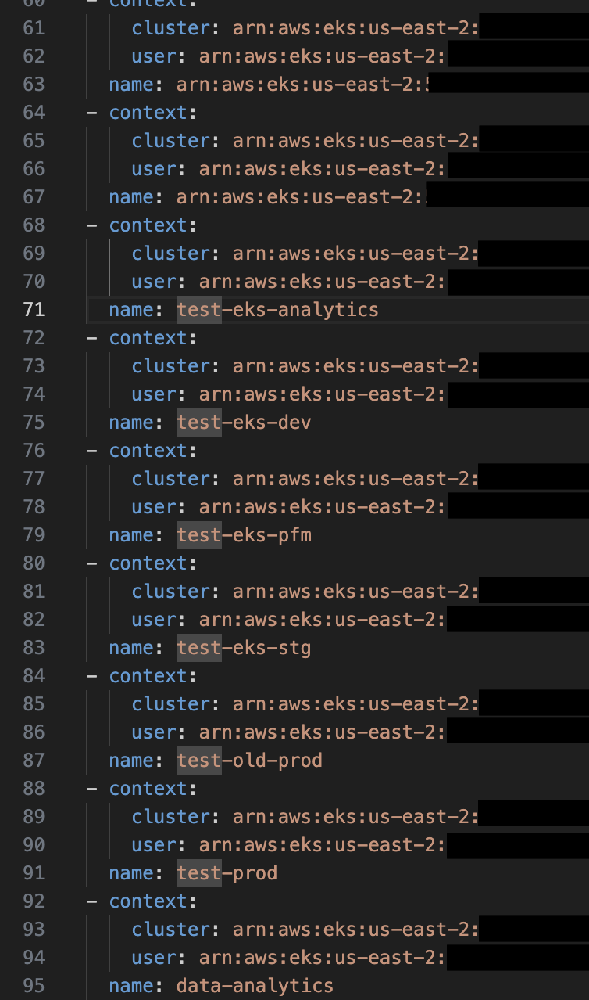

## Laziness has struck again
This situation is not the first time this has happened to me, it usually looks like a, you get to a new job, they give you access to AWS only to realize, they have a lot of accounts and there the laziness starts, you create the SSO profiles and now what, are we going to create all the Kubernetes contexts by hand.


## I don't think so
When it's 2 or 3 accounts, it's acceptable to some extent, but let's imagine it's 3 accounts, with 10 regions, it doesn't sound so easy anymore, does it.
So it is much easier to automate! To do this, I created the `Kube Context Creator` script which can be found [here](https://github.com/AzgadAGZ/kubernetes-scripts/tree/main/kubecontext-creator). 


Basically the script receives two inputs, `AWS_PROFILES` and `AWS_REGIONS`, which will iterate over both to list the clusters in each region, obtaining information such as the endpoint, certificate, cluster name, etc., and with this it will generate three important lists: `clusters`, `users` and `contexts`.
Once everything is generated, a temporary file will be created where this configuration is saved, and finally a merge is made with the `~/.kube/config` file that already exists in the user's folder (if not, an empty file is created and the new contexts are added). 


## Prerequisites
There is not much to talk about here, we need to have installed:
- Python3
- Pip3
- AWS CLI
- SSO profiles configured


## How to use it?
Once we have downloaded our [Kubernetes Scripts repository](https://github.com/AzgadAGZ/kubernetes-scripts) we proceed to go directly to the `kubecontext-creator` folder.

````bash
git clone https://github.com/AzgadAGZ/kubernetes-scripts
cd kubernetes-scripts/kubecontext-creator
pip3 install -r requirements.txt
````

Once there, we proceed to configure our `AWS_PROFILES` and `AWS_REGIONS` environment variables and run our script.
````bash
export AWS_PROFILES=account_one_sso,account_two_sso
export AWS_REGIONS=us-east-1,us-east-2

python3 main.py
````

After finishing, we can see our `~/.kube/config` file with a configuration similar to the following.




And that's it, our contexts are ready to use 🤖!
