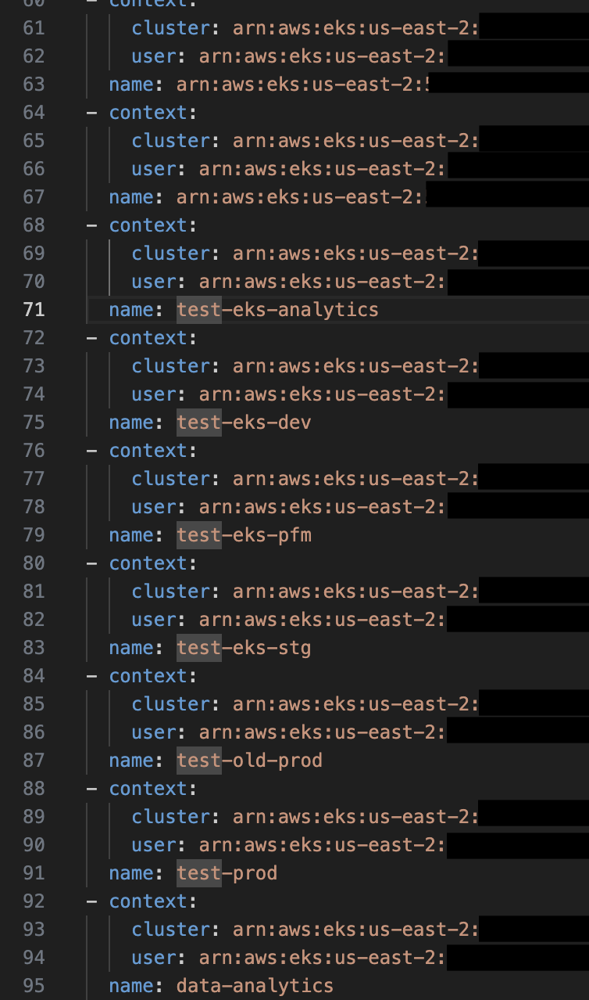

## La pereza nuevamente ha atacado
Esta situación no es la primera vez que me pasa, usualmente se ve como un, llegas a un nuevo trabajo, te dan acceso a AWS solo para darte cuenta, que tienen muchos accounts y ahí comienza la pereza, creas los perfiles de SSO 쯫 ahora que?, 쯨amos a crear todos los contextos de Kubernetes a manos?.


## No lo creo
Cuando son 2 o 3 accounts, es aceptable hasta cierto punto, pero imaginemos que son 3 cuentas, con 10 regiones, ya no suena tán fácil, 쯡o?.
Por ello, es mucho más fácil poder automatizar! Para ello cree el script de `Kube Context Creator` que podemos encontrar [aquí](https://github.com/AzgadAGZ/kubernetes-scripts/tree/main/kubecontext-creator). 

Básicamente el script recibe dos inputs, `AWS_PROFILES`y `AWS_REGIONS`, el cuál va a iterar sobre ambas para listar los clusters en cada región, obteniendo información como el endpoint, certificado, nombre del cluster, etc., y con ello va a generar tres listas importantes: `clusters`, `users` y `contexts`.
Una vez generado todo, se va a querer un archivo temporal donde esta configuración se guarda de manera temporal, y finalmente se hace un merge con el archivo `~/.kube/config` que ya exista en el folder del usuario (en caso de no hacerlo, se crea un arcivo vacio y se añaden los nuevos contexts.) 


## Pre-requisitos
No hay mucho de que hablar aquí, necesitamos tener instalado:
- Python3
- Pip3
- AWS CLI
- Perfiles de SSO configurados


## 쮺omo usarlo?
Una vez descargado nuestro repositorio de [Kubernetes Scripts](https://github.com/AzgadAGZ/kubernetes-scripts) procedemos a ir directo al folder de `kubecontext-creator`.

````bash
git clone https://github.com/AzgadAGZ/kubernetes-scripts
cd kubernetes-scripts/kubecontext-creator
pip3 install -r requirements.txt
````

Una vez ahí, procedemos a configurar nuestras variables de entorno `AWS_PROFILES`y `AWS_REGIONS` y ejecutamos nuestro script.
````bash
export AWS_PROFILES=account_one_sso,account_two_sso
export AWS_REGIONS=us-east-1,us-east-2

python3 main.py
````

Tras concluir, podemos ver nuestro archivo `~/.kube/config` con una configuración parecida a la siguiente.




Y listo, nuestros contextos están listos para usar 🤖!