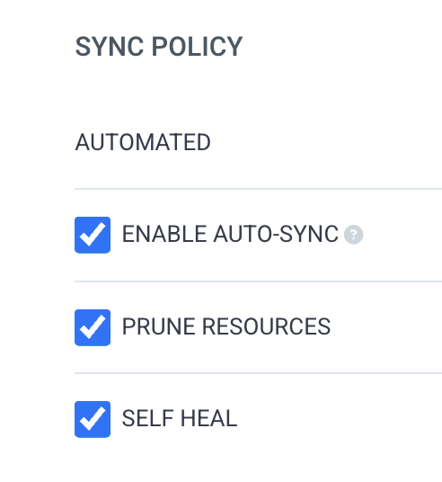
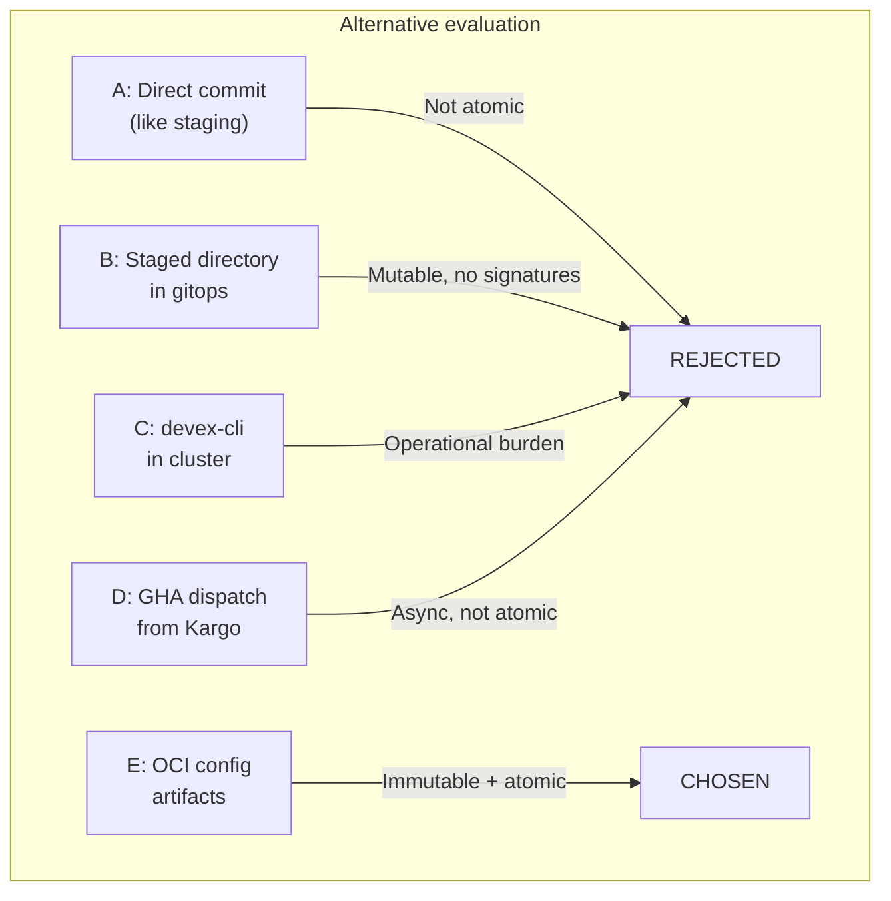
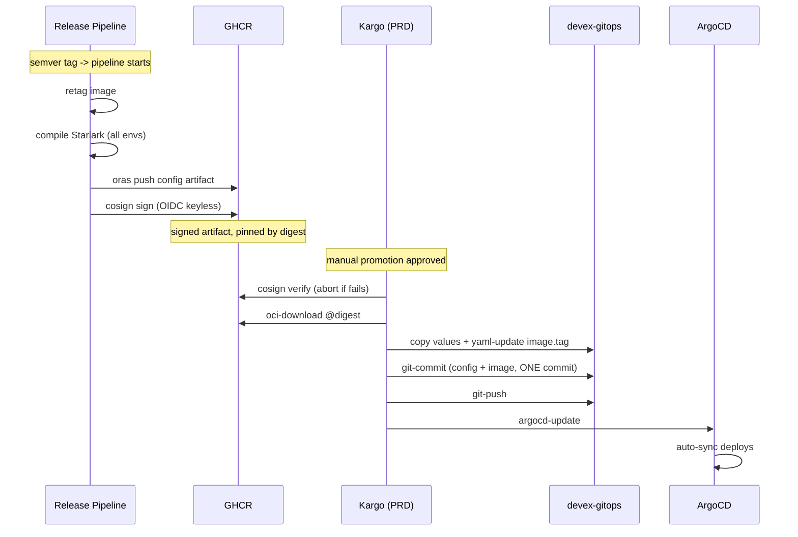
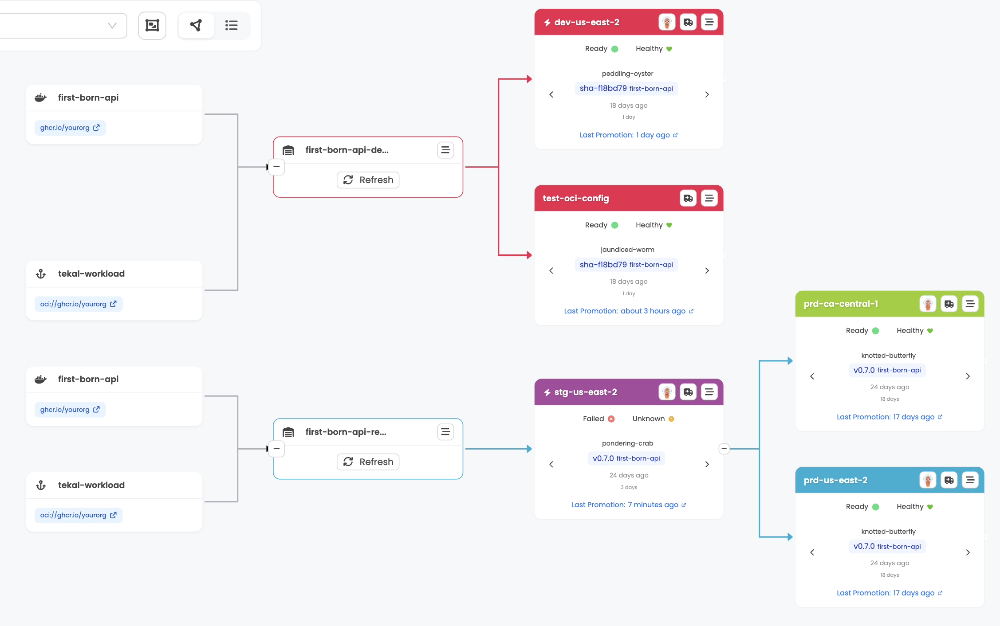
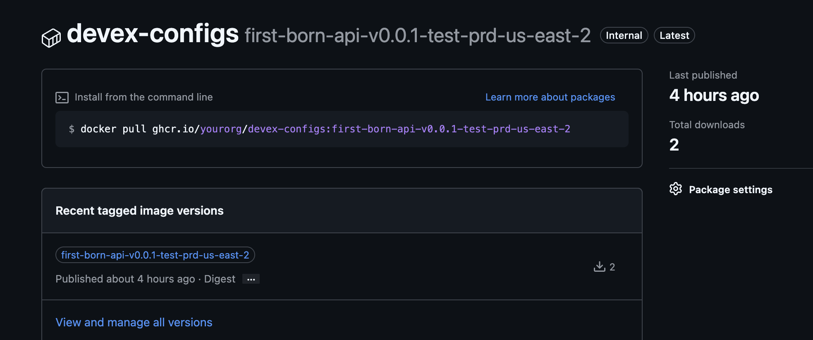
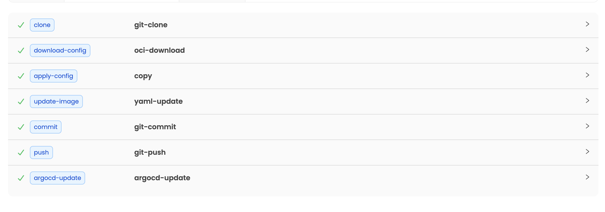
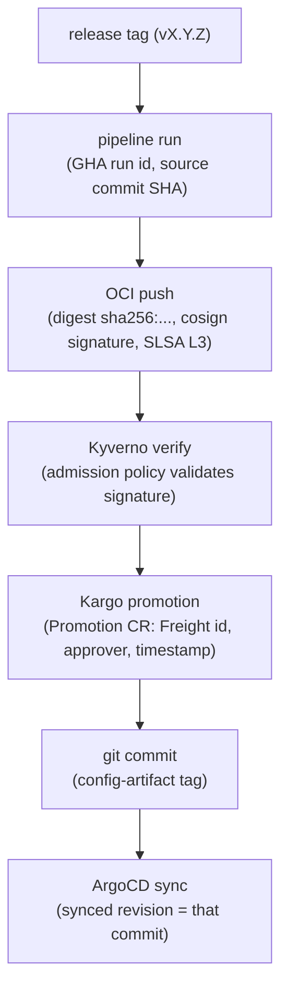

# Compiled Config as an OCI Artifact: Atomicity in Production with Kargo


The complete problem of auto-sync + atomicity + multi-region. The five alternatives I evaluated. The solution with OCI artifacts. The complete PromotionTask. The test results. And why your compiled config deserves the same treatment as your Docker image.


I've spent weeks solving a problem that seemed simple and ended up being a redesign of how compiled config reaches production. The short version: auto-sync in production + config as a file in git + multiple regions = a ticking time bomb. Here's everything I tried, what I discarded, and what became an ADR.

## The complete problem

Production runs with ArgoCD in auto-sync. `selfHeal: true`, `prune: true`. If anything in the gitops repo changes, **ArgoCD applies it. No questions asked. No waiting.**

Kargo controls promotions. In staging, auto-promote. In production, manual gate per region. US and CA promote independently. Each region with its own gate, its own timing.

Config compilation comes from Starlark. `service.star` + `deploy/prd-region.star` produces the final values.yaml: replicas, resources, probes, secrets, env vars, **everything**. Kargo only updates `image.tag` via `yaml-update` during promotion.

The problem: if the CD pipeline commits the compiled values.yaml to the path ArgoCD watches, the deployment starts before Kargo promotes the image. New config with old image. In staging this doesn't matter because Kargo promotes in seconds. In production with a manual gate, the window is hours.

And there's another problem. Two writers to the same repo: the CD pipeline (compiled config) and Kargo (image tag). No atomic transaction. If both write at the same time, merge conflicts. If one writes first, inconsistency window.

What about multi-region? US and CA need different config artifacts. Same service, same version, different region. If both promote at the same time, concurrent git-push to the same repo.

Three intertwined problems. Solving one without the other three doesn't work.


---

## Five alternatives, only one survived

Before arriving at the solution, I went through four paths that didn't work. Each had partial merit and a flaw that made me discard it.

### A. Direct commit to the production path (like staging)

What we already had in staging. The pipeline commits compiled config to the path ArgoCD watches. Kargo promotes afterward.

**Why not:** Not atomic. Config arrives first, image after. Auto-sync triggers deployment with new config and old image. In staging it works because Kargo promotes in seconds, but in production with manual gates, the window can be hours. Plus, two writers to the same repo without coordination.

### B. Staged directory in the gitops repo

Commit compiled config to an intermediate directory (`/staged/prd/`) that ArgoCD doesn't watch. Kargo copies it to the final path during promotion.

**Why not:** Mutable. Someone can edit the staged file between the commit and the promotion. Contaminates git history with intermediate files. No signatures, no digest, fragile path-filter. And you still have two writers.

### C. Custom container in the cluster

A custom step in Kargo that runs the CLI we built from Platform Engineering to compile config from Starlark at promotion time, directly in the cluster.

**Why not:** Operational burden. Every CLI update requires a container rebuild. Couples the promotion to a specific CLI version. Expands the cluster's attack surface. Compilation tooling doesn't belong in the CD control plane.

### D. GitHub Actions workflow_dispatch from Kargo

A custom step in Kargo that triggers a GitHub Actions workflow to commit the compiled config to the gitops repo.

**Why not:** External dependency. Asynchronous. The Kargo promotion doesn't know if the workflow finished, and it's not atomic. If GHA is down, the promotion hangs, adding unnecessary latency or timeouts.

### E. OCI config artifacts (the winner)

Compile config at release time, package it as an OCI artifact, push it to the registry with a Cosign signature. Kargo downloads it at promotion time and puts it in the gitops repo together with the image tag in a single atomic commit.

**Why it won:** Immutable, signed, and auditable. A single writer to the gitops repo (Kargo). Config and image in one commit. Zero inconsistency window. No new tooling in the cluster. The same registry infrastructure you already use for images.



---

## The architecture

Two pipelines. Total separation of responsibilities.

The release pipeline (CD) compiles, packages, and signs. Never touches the gitops repo. Kargo downloads, verifies, writes, and deploys. A single writer through an atomic commit.



The important part: the CD pipeline **never** writes to devex-gitops. Only Kargo does.



---

## Uniform pattern for all environments

The same flow applies for development, staging, and production. What changes is the trigger and the promotion gate.

| Environment | Trigger | OCI artifact tag | Kargo promotion |
|-------------|---------|-----------------|-----------------|
| dev | Push to main | `{svc}-sha-{hash}-dev-us-east-2` | Auto-promote |
| stg | Semver tag | `{svc}-v1.2.0-stg-us-east-2` | Auto-promote |
| prd-us | Semver tag | `{svc}-v1.2.0-prd-us-east-2` | Manual |
| prd-ca | Semver tag | `{svc}-v1.2.0-prd-ca-central-1` | Manual |

One pattern. No exceptions. No special paths for staging, no workarounds for production. Development and staging are the rehearsal for exactly what's going to happen in production.

---

## The pipeline step: oras push + cosign

This goes in your GitHub Actions release workflow. After compiling the config with Starlark for each region:

```bash
oras push \
  "ghcr.io/yourorg/devex-configs:${SERVICE}-${VERSION}-${REGION}" \
  --artifact-type application/vnd.devex.config.v1+json \
  "values.yaml:application/vnd.devex.config.values.v1+yaml"

DIGEST="$(crane digest ghcr.io/yourorg/devex-configs:${SERVICE}-${VERSION}-${REGION})"
cosign sign --yes "ghcr.io/yourorg/devex-configs@${DIGEST}"
```

Three lines. `oras push` uploads the values.yaml as an OCI artifact with a custom media type. `crane digest` gets the exact digest. `cosign sign` signs with pipeline OIDC (Sigstore keyless, GHA workflow identity).

The artifact lives in the same GHCR where you already have your images. Same auth, same garbage collection, same billing.



---

## The complete Kargo PromotionTask

This is the PromotionTask that Kargo executes for each promotion to production. Each region has its own Stage instance, but they share the same task.

```yaml
apiVersion: kargo.akuity.io/v1alpha1
kind: PromotionTask
metadata:
  name: promote-prd-region
  namespace: devex-kargo
spec:
  vars:
    - name: service
    - name: region
    - name: imageRepo
    - name: gitopsRepo
      value: https://github.com/yourorg/devex-gitops.git
    - name: configRepo
      value: ghcr.io/yourorg/devex-configs
    - name: valuesPath
      value: services/${{ vars.service }}/${{ vars.region }}/values.yaml
    - name: version
      value: ${{ imageFrom(vars.imageRepo).Tag }}
    - name: configTag
      value: ${{ vars.service }}-${{ vars.version }}-${{ vars.region }}
  steps:
    # 1. Clone gitops repo
    - uses: git-clone
      config:
        repoURL: ${{ vars.gitopsRepo }}
        checkout:
          - branch: main
            path: ./gitops

    # 2. Download OCI config artifact
    - uses: oci-download
      as: download-config
      config:
        imageRef: ${{ vars.configRepo }}:${{ vars.configTag }}
        mediaType: application/vnd.devex.config.values.v1+yaml
        outPath: ./config/values.yaml

    # 3. Copy config to the gitops repo path
    - uses: copy
      config:
        inPath: ./config/values.yaml
        outPath: ./gitops/${{ vars.valuesPath }}

    # 4. Update image.tag (from Freight)
    - uses: yaml-update
      config:
        path: ./gitops/${{ vars.valuesPath }}
        updates:
          - key: image.tag
            value: ${{ vars.version }}

    # 5. Atomic commit: config + image.tag in ONE
    - uses: git-commit
      as: commit
      config:
        path: ./gitops
        message: |
          chore(${{ vars.service }}): promote ${{ vars.region }} to ${{ vars.version }}

          config-artifact: ${{ vars.configRepo }}:${{ vars.configTag }}

    # 6. Push
    - uses: git-push
      config:
        path: ./gitops

    # 7. Sync ArgoCD pointing to the exact commit
    - uses: argocd-update
      config:
        apps:
          - name: ${{ vars.service }}-${{ vars.region }}
            sources:
              - repoURL: ${{ vars.gitopsRepo }}
                desiredCommit: ${{ task.outputs.commit.commit }}
```

Seven steps. The two that matter are: **oci-download** (downloads the config artifact from the registry) and **git-commit** (config + image.tag in a single atomic commit).

The commit message includes the artifact tag. When an auditor asks "what config was deployed in this promotion?", the answer is in the commit.

---

## Test results

8 components validated before going to production:

| Component                                  | Status |
| ------------------------------------------ | ------ |
| oci-download with arbitrary artifacts      | PASS   |
| copy overwriting existing files            | PASS   |
| ORAS -> oci-download compatibility         | PASS   |
| ArgoCD + Argo Rollouts                     | PASS   |
| argocd-update + multi-source               | PASS   |
| GHCR as OCI artifact store                 | PASS   |
| Kargo auth to GHCR                         | PASS   |
| Concurrent git-push (US + CA)              | PASS   |

The complete end-to-end: 7 steps, ~5 seconds.

| Step | Alias           | Duration | Result                                     |
| ---- | --------------- | -------- | ------------------------------------------ |
| 1    | clone           | 1s       | Cloned devex-gitops                        |
| 2    | download-config | 1s       | OCI artifact downloaded from GHCR          |
| 3    | apply-config    | <1s      | values.yaml replaced with OCI content      |
| 4    | update-image    | <1s      | image.tag updated from Freight             |
| 5    | commit          | <1s      | Atomic commit (config + image.tag)         |
| 6    | push            | 2s       | Push to branch                             |
| 7    | argocd-update   | <1s      | ArgoCD syncs to exact commit               |

~5 seconds for a complete promotion. Config downloaded, applied, committed together with the image tag, pushed, and synced. No human in the loop and no external dependencies.

An extra detail that cost a fair bit of debugging: the `argocd-update` timeout in staging wasn't a Kargo bug (issue #4020 as we initially suspected). It was a missing pull secret for GHCR. Kyverno wasn't generating the secret in the service's namespace. ArgoCD tried to sync, the pod couldn't pull the image, timeout. The fix was a Kyverno ClusterPolicy, not a Kargo change.



---

## Config changes to production: just `git tag`

A config change to production **is** a release. Same pipeline, same flow, zero special paths.

Example: you need to bump replicas from 3 to 5 for a service in prd-us.

1. Change `deploy/prd-us-east-2.star` (replicas 3 -> 5)
2. PR, review, merge to main
3. `git tag v1.2.1` -> the release pipeline runs
4. The image retag is idempotent (same digest, same image)
5. New config gets compiled, pushed as an OCI artifact, signed
6. Kargo creates Freight -> STG auto-promote (it's a no-op, staging config didn't change) -> PRD manual promote

The same pipeline you use for a deploy with new code works for a config change without code. The image retag produces the same digest, the OCI artifact has the new config, Kargo promotes when you approve.

No workarounds, no special paths, no "edit the values.yaml directly and pray".

---

## Trade-offs: OCI gitless vs direct push

Nothing is free. Here's what you gain and what you pay.

| Aspect                        | OCI Gitless                                         | Direct gitops push (like STG)                            |
| ----------------------------- | --------------------------------------------------- | -------------------------------------------------------- |
| Atomicity                     | Config + image in one commit                        | Config arrives first, image after. Risk window           |
| Gitops writer                 | Only Kargo (single writer)                          | CI + Kargo (two writers, possible conflicts)             |
| Debugging                     | `oras pull` to inspect config (new skill)           | `git show` (already known)                               |
| PromotionTask complexity      | 6 steps (oci-download + copy + yaml-update + ...)   | 5 steps, one fewer                                       |
| CI dependencies               | ORAS in pipeline                                    | Nothing new                                              |
| Extra infra                   | OCI repo devex-configs + GC workflow                | Nothing                                                  |
| Immutability                  | Registry is append-only, signable with Cosign       | Git commit is mutable (force push, amend)                |
| Rollback                      | `oras pull` any previous version                    | `git show` of the commit, depends on git history         |

The real cost is one thing: your team needs to learn to inspect OCI artifacts. `oras pull` instead of `git show`. It's not hard, but it's a new skill. If someone needs to see what config was deployed, they now go to the registry instead of git history.

The real benefit is also one thing: **certainty**. You know that what you compiled is exactly what got deployed. No ambiguity, no "did someone edit that file between the build and the deploy?".

---

## Scalability: GHCR today, Harbor when you need it

How much does this cost in storage? Almost nothing. A values.yaml weighs kilobytes.

| Scale | Tags/month | Storage/year | Registry |
|-------|------------|--------------|----------|
| 20 services (today) | ~160 | ~4 MB | GHCR |
| 100 services | ~800 | ~20 MB | GHCR |
| 500 services | ~4k | ~100 MB | GHCR |
| 1k services | ~8k | ~1.9 GB | GHCR (monitor quota) |
| 3k+ services | ~24k | ~5.7 GB | Evaluate Harbor |

GHCR scales seriously. We don't need Harbor today. We probably won't need it tomorrow. But we know it's there in case we do.

**When do you actually need Harbor?**
- Data residency regulation requiring infrastructure control
- Regulatory audit requiring tag immutability as a compliance requirement
- Multi-region artifact locality (Harbor replicates US <-> CA)
- 500+ services with complex retention policies

The migration is a URL change per service in the `configRepo` variable of the PromotionTask. Same OCI convention, same Kargo flow, zero changes in promotion logic.

### Tag cleanup strategy
You don't want to accumulate tags forever. But you also don't want to delete something you need for rollback.

| Rule                                        | Retention    | Reason                         |
| ------------------------------------------- | ------------ | ------------------------------ |
| Currently deployed in any env               | NEVER delete | Rollback safety                |
| Promoted to PRD (ever)                      | >= 13 months | SOC2 audit window              |
| Never promoted to PRD                       | 90 days      | Obsolete release candidates    |

A GHA workflow that runs weekly, queries the active Freight from Kargo, and cleans up what's not in use or within the retention window.

---

## Compliance: end-to-end audit trail

If you work in healthcare, fintech, or any regulated industry, this matters to you. Every step in the flow leaves a verifiable record.



From the release tag to the ArgoCD sync, each link points to the previous one. If an auditor asks "what exactly was deployed to production on Tuesday at 3pm?", you trace the complete chain.

The git commit in the gitops repo includes the artifact tag. The tag points to the artifact in GHCR. The artifact has a Cosign signature with the pipeline's OIDC identity. The signature points to the GHA workflow. The workflow points to the source code commit, and the commit has the semver tag.

**Complete chain. Verifiable. No gaps.**

### Signature verification: where and how

Cosign signs the artifact in CD. Where is it verified?

Kargo OSS doesn't support custom steps with arbitrary containers (that's Akuity Platform Enterprise). But verification doesn't need to live inside Kargo. There are two real options:

**Option 1: Kyverno as admission policy.** A ValidatingPolicy that intercepts Kargo Promotions and verifies the OCI artifact signature before admitting them. If the signature isn't valid, the Promotion doesn't even start. Enforcement stays in the Kubernetes control plane, not in the pipeline.

**Option 2: Verify in CI, trust the tag.** The release pipeline signs with Cosign via OIDC. The artifact tag includes the release version, and only the release workflow can push (OIDC identity). Since the tag is never republished (one version = one tag = one digest), immutability is by process. It's not the same as cryptographic verification in the promotion path, but for many teams it's sufficient.

We validated Cosign sign + verify locally during implementation. The round-trip works: `cosign sign` in CI, `cosign verify` with the correct OIDC issuer. The pending piece is automatic enforcement, which we implemented with Kyverno.

### Failure modes

| Failure | Behavior |
|---------|----------|
| Tag doesn't exist or artifact absent | `oci-download` fails, Kargo aborts the promotion |
| git-push non-fast-forward | Promotion fails; concurrency limit prevents the race condition |
| Artifact without signature (with Kyverno) | Kyverno rejects the Promotion before it starts |

If Kargo says the promotion was successful, the artifact was downloaded, config and image.tag were committed together, and ArgoCD synced.

Region isolation is guaranteed by a Kyverno ValidatingPolicy, not just a naming convention. If someone tries to apply US config in the CA namespace, Kyverno rejects it at admission control level.

---

## Industry precedent

This isn't a new idea. It's a pattern the industry has been moving toward mainstream for years.

| Source | Link | Insight |
|--------|------|---------|
| Google Cloud | [Config as OCI artifacts with Config Sync](https://cloud.google.com/blog/products/containers-kubernetes/gitops-with-oci-artifacts-and-config-sync) | Config as OCI artifacts, sync from registry, not from git |
| KubeCon EU 2025 | [Introduction to Gitless GitOps](https://dev.to/t-kikuc/introduction-to-gitless-gitops-a-new-oci-centric-and-secure-architecture-2pgi) | "Configuration is Part of the Supply Chain" |
| CNCF/Harbor | [Harbor as Universal OCI Hub](https://goharbor.io/blog/harbor-as-universal-oci-hub/) | Multi-zone replication of config + images + signatures |
| ArgoCD 3.1+ | [Native OCI source](https://argo-cd.readthedocs.io/en/stable/user-guide/oci/) | Native `oci://` support as K8s manifest source |
| Netflix/Spinnaker | [Declarative Delivery Configs](https://spinnaker.io/docs/guides/user/managed-delivery/delivery-configs/) | Declarative promotion of immutable artifacts across environments |
| Flux CD | [Push OCI artifacts with Flux CLI](https://oneuptime.com/blog/post/2026-03-05-push-oci-artifacts-flux-cli/view) | `flux push artifact` for config as OCI |
| Flux CD | [Gitless GitOps with OCI](https://oneuptime.com/blog/post/2026-03-05-gitless-gitops-oci-artifacts-flux/view) | Complete GitOps without git as transport |
| codecentric | [Air-gapped GitOps with OCI](https://www.codecentric.de/en/knowledge-hub/blog/max-isolated-kubernetes-gitops-with-fluxcd-and-oci-repositories) | Air-gapped deployments via OCI |
| Kargo | [Community request for this pattern](https://github.com/akuity/kargo/issues/4864) | The community requested exactly this pattern |
| Kargo | [oci-download step reference](https://docs.kargo.io/user-guide/reference-docs/promotion-steps/oci-download) | Documentation for the step that makes this possible |

Google documents it. Flux implements it. Harbor supports it natively. ArgoCD 3.1 ships it out of the box. Netflix has been doing it for years with Spinnaker, and the Kargo community explicitly requested it.

It's not bleeding edge. It's convergence.

---
## What remains

Compiled config is not a file. It's build output. It deserves the same treatment as a Docker image: immutable, versioned, signed, verified before deploying.

If you have auto-sync in production and your compiled config lives as a file in git, the question isn't whether you'll have an atomicity incident. It's whether you really want to live with it catching you when you least expect it.

The solution isn't to turn off auto-sync, or stop compiling config, or add fragile path-filters. It's to treat your config as what it is: an artifact in your supply chain. Package it, sign it, let your promotion controller download it and apply it atomically with the image.

One pipeline, one pattern, all environments. Zero extra writers to the gitops repo. Zero inconsistency windows. ~5 seconds end to end.

`git tag v1.2.1`. The rest is automatic.
