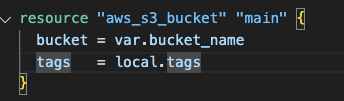
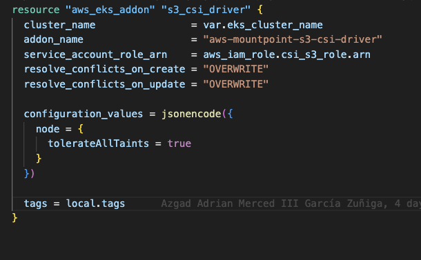
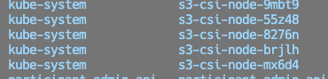
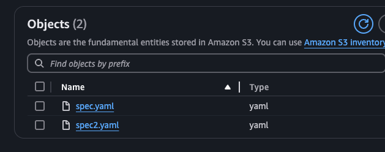
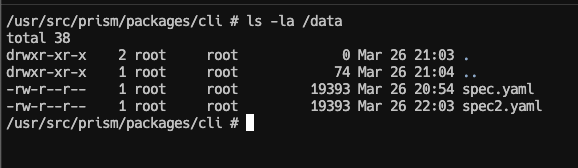

## How it all started

Internally at SPIN, we had a cross-functional initiative to start working with an "**API First**" approach, where APIs are treated as "first-class citizens" and described first before writing any implementation. API Design-first means that teams spend a lot of time in the design lifecycle, sharing the design, working with stakeholders, getting feedback, and in turn, revising the design until it's finalized.

Once we defined the tools and the whole process that would help us carry out this initiative, we started thinking about "**mocks**," which we can understand as pre-programmed objects with expectations that form a specification of the calls they are expected to receive. In other words, an object that imitates the interface and properties of a real function, a class, a module, or any other software element, with a defined behavior.

The way to make this available to our team is through "**mock servers**," which are simply definitions of mocks exposed as an API. With this in mind, we decided to use [Prism](https://github.com/stoplightio/prism) since, along with [Spectral](https://github.com/stoplightio/spectral), which allows us to lint OpenAPI specs using internal business rules, Prism provides us with an easy way to expose the mock server with its own CLI.

We had some considerations along the way. First, all specification files would be hosted in a mono-repo to centralize and avoid one-to-one repository relationships (since we already have many). Another consideration was that these mock servers would also be used for load testing at some point, so they should be able to scale as needed, as well as have the flexibility to be used in other use cases.

The general idea was simple: for each service that needed a mock server, we would use the Docker image that Prism provides, pass it the corresponding specification file, and deploy it to EKS using a Helm chart.

## What's the Problem?

The difficulty we faced was how to easily get that specification file into the EKS deployment and spin up the mock server, all with zero human intervention and fully automated. We came up with some options that were eventually discarded.

### Re-packaging the Image

We mentioned that Prism already has its own Docker image, so one option was to take that image during the Continuous Deployment process and build a new one "on the fly," embedding the file using a Dockerfile prepared for this. While this approach could fulfill much of what we were looking for, let's be honest, it feels more like a "patch" to get out of the problem than a definitive solution.

### Init Container

Another option was to use an init container in Kubernetes. As we know, they run before the application starts, so it was technically feasible. However, the problem boiled down to scalability. The init container could mount the same EBS as the application and leave the file ready on the nodes of a defined Availability Zone (AZ), but what about the rest of the nodes? As we know, EBS only live in a single AZ, so if we had replicas on nodes belonging to different AZs, they wouldn't be able to use the file and start correctly.

### EFS (Elastic File System)

Native to AWS, it can be mounted from multiple AZs, is scalable, and compatible with the Container Storage Interface (CSI) Driver, allowing easy integration with our current flows. Everything seemed perfect until we faced reality. The decisive question was, how do we upload the file we needed there? To achieve this, there were two obvious options:

1.  Someone would have to manually mount the EFS and upload the file to it, which completely breaks the goal of automation and zero human intervention.
2.  Deploy a solution called [Simple File Manager](https://aws.amazon.com/es/solutions/implementations/simple-file-manager-for-amazon-efs/) that provides an interface for managing EFS. This only solves the "difficulty" of mounting it manually but fails in the same way as the first option. Similarly, if this solution with NFS were used for more things (the flexibility we talked about above), it would add an extra layer of cost for us, since about 50 AWS accounts would have to deploy the stack.

Therefore, both options did not meet the need, not to mention the cost issue.

## Solving Everything from the Root

Up to this point, we were still living with the problem, but what matters is solving it, right? To recap the need up to this point, what we were looking for was a list of features:

* Flexibility
* Scalability
* Cost-effectiveness
* Multi-AZ
* Automatable
* Zero human intervention

And then everything became clear. What if we used S3? Is that even possible? It is! And best of all, it met every point of what we were looking for. Digging a little deeper into the subject, we found that it also has support through the Kubernetes CSI Driver, which made it a strong candidate.

## Creating and Configuring the Infrastructure

For everyone's convenience, I'm leaving [this repository](https://github.com/AzgadAGZ/k8s-csi-s3-poc/tree/main/terraform) where all the Terraform files and Kubernetes manifests are, which will be used from now on.

Starting the test, the first thing we created was an S3 bucket called **prism-poc-spin**.



After that, the next step is the entire authentication part, specifically the IAM policy, which must have sufficient permissions to access S3 and its objects.


Now we proceed to create the role, which must have the [IAM OIDC provider](https://docs.aws.amazon.com/eks/latest/userguide/enable-iam-roles-for-service-accounts.html) (if it doesn't exist, it's a good time to create it) of our cluster as the "principal." The action must be `sts:AssumeRoleWithWebIdentity` so that the role can be assumed by OpenID. The line `"system:serviceaccount:kube-system:s3-csi-driver-sa` should only be changed if EKS changes the name of the SA when installing the Addon; otherwise, it can remain the same.


Continuing, we attach the role and the previously created policy.


Finally, we add the addon to our EKS cluster, which will deploy a `daemonset` on all our nodes, giving them the ability to use S3 as a `Persistent Volume`.





## Mounting S3 as a Volume

To reach our goal, all that remains is to test that everything works correctly. We created some [Kubernetes manifests](https://github.com/AzgadAGZ/k8s-csi-s3-poc/tree/main/k8s-manifests) that were needed to test everything, where we had to configure based on what was previously created.

The first relevant part to create is the `Persistent Volume`. In this file, important parts are configured, such as `accessModes`, which define the writing and/or reading to S3. In this case, we only need to read the files, so `ReadOnlyMany` is sufficient. The `mountOptions --allow-other` provides access to users other than the **root** to access the mount. `region`, as its name suggests, is the AWS region where the bucket lives. `prefix` is an optional attribute; in this case, it was defined to mount specific "folders" of the bucket if you want to reuse it with several applications. And finally, `csi.volumeAttributes.bucketName`, which defines the name of the bucket to be mounted and must match the SA and the role created previously.

````yaml
apiVersion: v1
kind: PersistentVolume
metadata:
  name: s3-pv
spec:
  capacity:
    storage: 1000Gi
  accessModes:
    # Supported options: ReadWriteMany / ReadOnlyMany
    - ReadOnlyMany  
  mountOptions:
    # This allow to users others than root to access the mount
    - allow-other
    # Bucket region
    - region=us-east-1
    # This allow use to use a prefix for the S3 Bucket, so we can re-use the same with different applications
    - prefix prism-app-1/ 
  csi:
    driver: s3.csi.aws.com
    volumeHandle: s3-csi-driver-volume
    volumeAttributes:
      # Bucket name
      bucketName: "prism-poc-spin"
````

The second is the `Persistent Volume Claim`, which, as you know, is basically a request for space to a specific type of storage, in our case, the `PV` that we link to S3. The only relevant thing here is the `resources.requests.storage` of 1 Gi (honestly, it needs much less), and the `volumeName` that must match the name of the `PV`.

````yaml
apiVersion: v1
kind: PersistentVolumeClaim
metadata:
  name: s3-claim
  namespace: prism
spec:
  accessModes:
    - ReadOnlyMany
  storageClassName: "" 
  resources:
    requests:
      storage: 1Gi 
  volumeName: s3-pv
````

Last but not least, the `Deployment`. In this, we will use the `SA` that we created previously, and also the volume, which we will assign to the path `/data` inside the container.

````yaml
# deployment.yaml

apiVersion: apps/v1
kind: Deployment
metadata:
  name: prism-deployment
spec:
  ...
  serviceAccountName: prism-poc-spin-sa  # According to the previous SA created
  securityContext: {}
  containers:
    - name: prism
      image: stoplight/prism:latest
      args: ["mock", "-h", "0.0.0.0", "/data/spec.yaml"]
      ...
      volumeMounts:
        - name: s3-bucket
          mountPath: /data
  volumes:
    - name: s3-bucket
      persistentVolumeClaim:
        claimName: s3-claim # Must match the PVC created before
````

Once we have all this ready, we proceed to deploy the manifests to our cluster using `kubectl apply -f namespace.yaml && kubectl apply -f .` (being in the corresponding folder).

## Testing Functionality
To quickly verify that it works correctly, we access the pod directly and run a `ls -la /data/`, where we will see the corresponding files that we have in S3, therefore Prism can start without a problem.






That's all! I hope you found it useful! :rocket:
