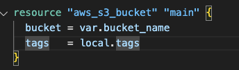
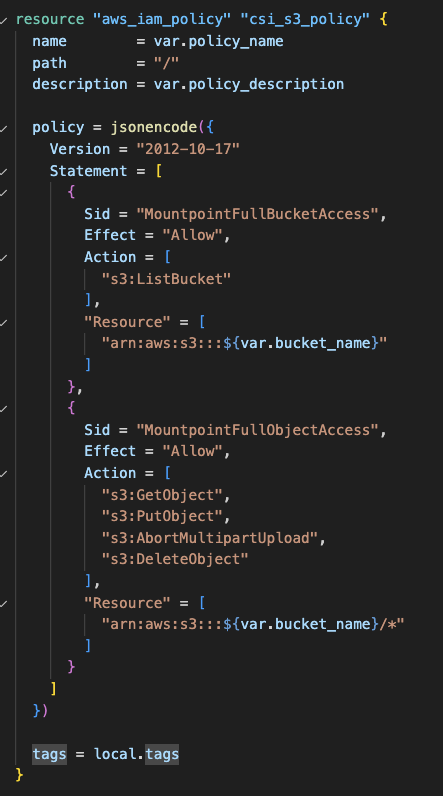
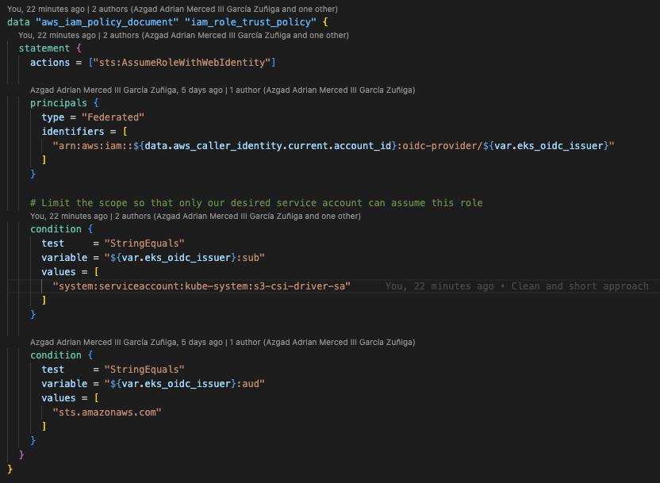
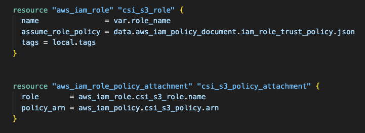
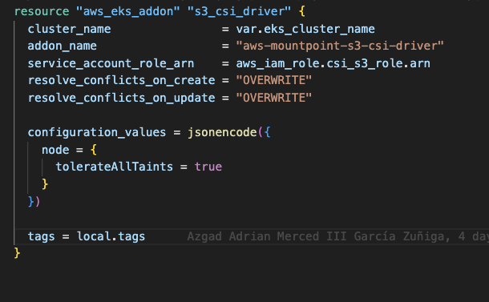
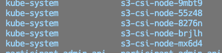
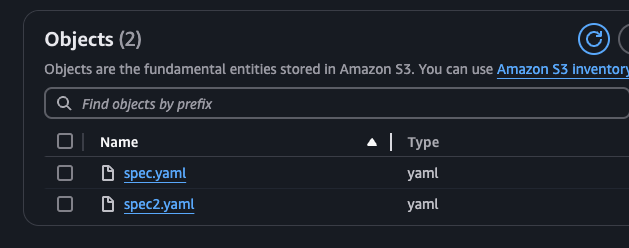
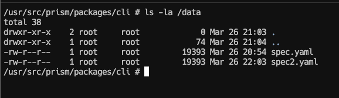

## Como inició todo
Internamente en SPIN, teníamos una iniciativa a nivel transversal de comenzar a trabajar con un enfoque "**API First**", en el cual las APIs se tratan como “ciudadanos de primera clase” y se describen primero antes de escribir cualquier implementación. API Design-first significa que los equipos pasan mucho tiempo en el ciclo de vida del diseño, compartiendo el diseño, trabajando con las partes interesadas, recibiendo comentarios y, a su vez, revisando el diseño hasta que esté finalizado. 

Una vez definidas las herramientas y todo el proceso que nos ayudaría a llevar a cabo esta iniciativa, comenzamos a pensar en los "**mocks**", los cuales podemos entenderlos como objetos pre-programados con expectativas que forman una especificación de las llamadas que se espera que reciban, en otras palabras, un objeto que imita la interfaz y propiedades de una función real, una clase, un módulo o cualquier otro elemento de software, con un comportamiento definido.

La manera de poner a disposición esto para nuestro equipo es a través de "**mock servers**", los cuales simplemente son definiciones de mocks expuestas como una API. Entendido esto, se decidió usar [Prism](https://github.com/stoplightio/prism) dado que junto con [Spectral](https://github.com/stoplightio/spectral), que nos permite hacer linting a los specs de OpenAPI usando reglas de negocio internas, Prism, nos provee una manera sencilla de exponer el mock server con su propio CLI.

Algunas consideraciones se tuvieron en el camino, es que todos los archivos de especificaciones estarían alojados en un mono-repo, esto con el fin de centralizar y evitar relaciones uno a uno de repositorios (dado que ya se tienen muchos). Otra consideración fue que, estos mock server serían usados también para pruebas de carga en algún momento, entonces deberían de poder escalar conforme la necesidad lo requiera, así como flexibilidad para usarse en otros casos de uso.

La idea general era simple, por cada servicio que necesitara un mock server, mediante un helm chart, usar la imagen de docker que Prism disponibiliza, pasarle el archivo de la especificación correspondiente y desplegar eso a EKS.

## Cuál es el problema?
La dificultad que enfrentábamos era como llevar de una manera sencilla ese archivo de especificación hacia el despliegue en EKS y levantar el mock server, todo esto con cero intervención humana y totalmente automatizado. Saltaron algunas opciones descartadas en el camino.

### Re-empaquetar la imagen
Mencionábamos que Prism ya tiene su propia imagen de docker, por lo cual una opción era que durante el proceso de Continuous Deployment se tomara esa imagen, se construyera una nueva "al vuelo" incrustando el archivo mediante un Dockerfile ya preparado para esto. Si bien este acercamiento pudiera cumplir mucho de lo que buscábamos, seamos sinceros, se siente más como un "parche" para salir del problema que una solución definitiva. 


### Init Container
Otra opción, era el uso de un init container en Kubernetes, como bien sabemos, se ejecutan antes de iniciar la aplicación, por lo cual era técnicamente factible, sin embargo, el problema se reducía a la escalabilidad. El init container podría montar el mismo EBS que la aplicación y dejar el archivo listo en los nodos de una Availability Zone (AZ) definida, pero que pasaba con el resto de los nodos? Como sabemos los EBS solo viven en una sola AZ, por lo tanto, si teníamos réplicas en nodos pertenecientes a AZs diferentes, no iban a poder usar el archivo e iniciar correctamente.

### EFS (Elastic FIle System)
Nativo de AWS, permite ser montado desde múltiples AZs, escalable y compatible con el Container Storage Interface (CSI) Driver permitiendo una fácil integración con nuestros flujos actuales, todo parecía ser perfecto, hasta que nos enfrentamos con la realidad; la pregunta decisiva fue, como subimos el archivo que necesitábamos ahí? Para lograrlo había dos opciones obvias: 
1. Manualmente alguien debería de montar el EFS y subir el archivo a él, lo cual rompe totalmente el objetivo de automatización y cero intervención humana.
2. Desplegar una solución llamada [Simple File Manager](https://aws.amazon.com/es/solutions/implementations/simple-file-manager-for-amazon-efs/) que provee una interfaz para el manejo de los EFS, esto solo soluciona la "dificultad" de montarlo manualmente, pero falla en lo mismo que la primera opción. De igual manera, si esta solución con NFS se usara para más cosas (la flexibilidad que hablábamos arriba) añadiría una capa extra de costo para nosotros, dado que alrededor de 50 cuentas de AWS tendrían desplegar el stack.

Por lo tanto, ambas opciones incumplían la necesidad, sin mencionar el tema del costo.

## Resolviendo todo de raiz
Hasta aquí, seguíamos viviendo con el problema, pero lo que importa es resolver, ¿no?. Para recapitular la necesidad hasta aquí, lo que se buscaba era una lista de características:
- Flexibilidad
- Escalabilidad
- Costo
- Multi AZ
- Automatizable
- Cero intervención humana

Y entonces todo fue claro, y si usábamos S3? Es si quisiera posible? Lo es! Y lo mejor de todo es que cumplía cada punto de lo que estábamos buscando, indagando un poco más sobre el tema, encontramos que también tiene soporte a través del CSI Driver de Kubernetes lo cual lo volvió un fuerte candidato.

## Creando y configurando la infraestructura
Para comodidad de todos, dejo [este repositorio](https://github.com/AzgadAGZ/k8s-csi-s3-poc/tree/main/terraform) donde están todos los archivos de Terraform y los manifiestos de Kubernetes, que se usarán de aquí en adelante.

Comenzando a realizar la prueba, lo primero que se creó fue un bucket de S3 llamado **prism-poc-spin**.



Tras ello, el siguiente paso es toda la parte de la autenticación, específicamente la policy de IAM, que debe de tener suficientes permisos para acceder al S3 y a sus objetos.



Ahora procedemos a crear el rol, el cual deberá tener como "principal", el [IAM OIDC provider](https://docs.aws.amazon.com/eks/latest/userguide/enable-iam-roles-for-service-accounts.html) (si no existe, es buen momento para crearlo) de nuestro cluster, la acción debe de ser `sts:AssumeRoleWithWebIdentity` para que el rol pueda ser asumido por OpenID. La linea `"system:serviceaccount:kube-system:s3-csi-driver-sa` solo debe de ser cambiada en caso de que EKS cambie el nombre del SA al instalar el Addon, en caso contrario puede permanecer igual.



Continuando, realizamos un attachment del rol y la política creada previamente.




Por último, añadimos el addon a nuestro cluster de EKS, el cual desplegara un `daemonset` en todos nuestros nodos, dandoles la habilidad de poder usar S3 como `Persistent Volume`.





## Montando S3 como volumen
Para llegar a nuestra meta, no queda más que probar que todo funcionara correctamente. Se crearon algunos [manifestos de kubernetes](https://github.com/AzgadAGZ/k8s-csi-s3-poc/tree/main/k8s-manifests) que se necesitaban para probar todo, donde se tuvo que configurar basado en lo creado previamente.

La primera parte relevante a crear es el `Persistent Volume`, en este archivo se configuran partes importantes como `accessModes`, que nos define la escritura y/o lectura al S3, en este caso solo se necesita leer los archivos por lo cual un `ReadOnlyMany` es suficiente. El `mountOptions --allow-other`, proporciona acceso a otros usuarios que no sea el **root** para acceder al mount, `region` como su nombre sugiere, es la región de AWS donde vive el bucket, `prefix` es una atributo opcional, en este caso se definió para poder montar "folders" específicos del bucket en caso de que se quiera reutilizar con varias aplicaciones, y por último, `csi.volumeAttributes.bucketName` el cual define el nombre del bucket que se quiere montar, y que deberá de coincidir con el SA y el rol creados previamente.

````yaml
apiVersion: v1
kind: PersistentVolume
metadata:
  name: s3-pv
spec:
  capacity:
    storage: 1000Gi
  accessModes:
    # Supported options: ReadWriteMany / ReadOnlyMany
    - ReadOnlyMany  
  mountOptions:
    # This allow to users others than root to access the mount
    - allow-other
    # Bucket region
    - region=us-east-1
    # This allow use to use a prefix for the S3 Bucket, so we can re-use the same with different applications
    - prefix prism-app-1/ 
  csi:
    driver: s3.csi.aws.com
    volumeHandle: s3-csi-driver-volume
    volumeAttributes:
      # Bucket name
      bucketName: "prism-poc-spin"
````

Lo segundo es el `Persistent Volume Claim`, que como ya sabrán, es básicamente y tal cual una petición de espacio a un tipo especifico de almacenamiento, en nuestro caso, al `PV` que ligamos al S3. Lo único relevante aquí es el `resources.requests.storage` de 1 Gi (sinceramente necesita mucho menos), y el `volumeName` que debe de hacer match con el nombre del `PV`.

````yaml
apiVersion: v1
kind: PersistentVolumeClaim
metadata:
  name: s3-claim
  namespace: prism
spec:
  accessModes:
    - ReadOnlyMany
  storageClassName: "" 
  resources:
    requests:
      storage: 1Gi 
  volumeName: s3-pv
````

Por último, pero no por eso menos importante, el `Deployment`, en este, usaremos el `SA` que creamos previamente, y de igual manera el volumen, el cual asignaremos al path `/data` dentro del contenedor.

````yaml
# deployment.yaml
apiVersion: apps/v1
kind: Deployment
metadata:
  name: prism-deployment
spec:
    ...
      securityContext: {}
      containers:
        - name: prism
          image: stoplight/prism:latest
          args: ["mock", "-h", "0.0.0.0", "/data/spec.yaml"]
          ...
          volumeMounts:
            - name: s3-bucket
              mountPath: /data
      volumes:
        - name: s3-bucket
          persistentVolumeClaim:
            claimName: s3-claim # Must match the PVC created before
````

Una vez tengamos todo esto listo, procedemos a desplegar los manifiestos a nuestro cluster usando `kubectl apply -f namespace.yaml && kubectl apply -f .` (estando en el folder correspondiente).


## Probando funcionalidad
Para verificar que funciona correcto de manera rápida, accedemos directamente al pod y hacemos un `ls -la /data/`, donde veremos los archivos correspondientes a los que tenemos en S3, por lo tanto Prism puede iniciar sin problema.






Todo listo! Espero les haya servido! :rocket: